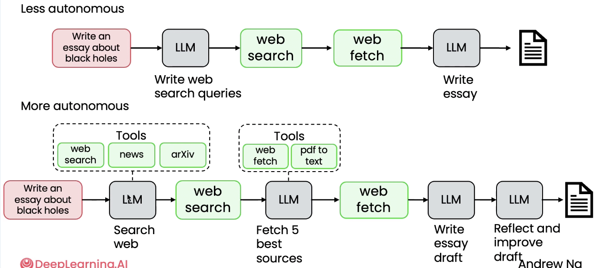

# 02. 자율성의 정도 (Degrees of autonomy)

> Module 1 · Lesson 2
> 이전 ← [01. 에이전틱 AI란](01-what-is-agentic-ai.md) · 다음 → [03. 에이전틱 AI의 이점](03-benefits.md)

## 한 줄 요약

"에이전트인가 아닌가"는 잘못된 질문이다.
**얼마나 에이전틱한가**를 스펙트럼으로 보고, 자율성 수준을 설계 선택으로 다뤄야 한다.

---

## 1. "에이전트" vs. "에이전틱" — 정의 논쟁 피하기

- AI 커뮤니티에서 무엇이 진정한 "에이전트"인지에 대한 논란이 있었음
- 이분법(에이전트다 / 아니다)으로 다루는 대신 **"에이전틱(agentic)"이라는 형용사**를 도입
- 시스템이 서로 다른 *정도로* 에이전틱할 수 있음을 인정하는 방식
- 결과적으로 정의 논쟁에서 벗어나 **실제 구축에 집중**할 수 있게 됨

## 2. 강좌 다이어그램 표기 규칙

이후 모든 슬라이드에서 반복되는 색상 규칙. 먼저 익혀두면 그림만 봐도 구조가 읽힌다.

| 색상 | 의미 | 예시 |
|---|---|---|
| 🔴 **빨간 박스** | 사용자 입력 | 쿼리, 입력 문서 |
| ⬜ **회색 박스** | LLM 호출 | 텍스트 생성, 판단, 추출 |
| 🟩 **초록 박스** | 소프트웨어/도구 호출 | 웹 검색 API, 웹페이지 가져오기 |

## 3. 자율성 낮은 에이전트 vs. 높은 에이전트



동일한 과제(**"블랙홀에 관한 에세이 작성"**)를 두 가지 자율성 수준으로 구현한 비교.

### 낮은 자율성 (위쪽)

```
[사용자 입력] → LLM(검색어 작성) → web search → web fetch → LLM(에세이 작성) → 문서
```

- 프로그래머가 설계한 **완전히 결정론적인 단계 순서**
- 자율성은 대부분 **LLM이 생성하는 텍스트에만** 존재
- 도구 사용(웹 검색 등)은 엔지니어가 하드코딩

### 높은 자율성 (아래쪽)

```
[사용자 입력] → LLM ─(도구 선택: web search / news / arXiv)→ web search
             → LLM ─(도구 선택: web fetch / pdf to text)→ web fetch
             → LLM(초안 작성) → LLM(검토 및 개선) → 문서
```

- LLM이 직접 판단: 일반 웹 검색인가, 최신 뉴스인가, 연구 논문(arXiv)인가
- 몇 개의 페이지를 가져올지, PDF를 텍스트로 변환할지, 초안을 검토·수정할지,
  최종 산출 전에 페이지를 더 가져올지도 LLM이 결정
- **프로그래머가 아니라 LLM이 단계의 순서를 결정**

> 그림에서 점선 `Tools` 박스가 붙은 LLM이 곧 "선택권을 가진 지점"이다.
> 이 점선 박스의 개수가 그 워크플로우의 자율성 수준을 시각적으로 보여준다.

## 4. 자율성 스펙트럼

| 수준 | 단계 순서 | 도구 | 특징 |
|---|---|---|---|
| **낮은 자율성** | 미리 정해짐 | 하드코딩 | 예측 가능, 제어 쉬움 |
| **반자율적** | 일부 에이전트가 결정 | 미리 정의된 것 중 선택 | 절충 |
| **높은 자율성** | 에이전트가 스스로 결정 | 새 함수·도구를 만들어 실행하기도 함 | 제어 어려움, 예측 불가 |

**실무적 시사점:**
자율성이 낮은 시스템은 오늘날 다양한 비즈니스에서 널리 사용되며 **큰 가치를 제공**한다.
자율성이 높은 시스템은 제어가 어렵고 예측 불가능성이 크며, 활발한 연구가 진행 중인 영역이다.

> 즉 "더 자율적일수록 좋다"가 아니다. 필요한 만큼만 자율성을 주는 것이 설계다.

## 5. 다음 레슨 예고

에이전트의 이점과, 이전 세대 애플리케이션으로는 불가능했던 일들을
에이전트가 어떻게 가능하게 하는지.
