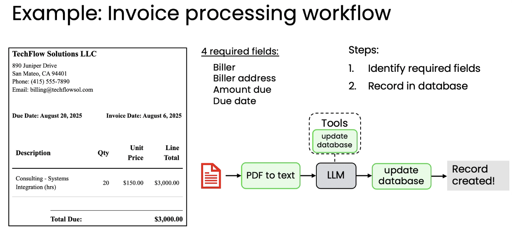
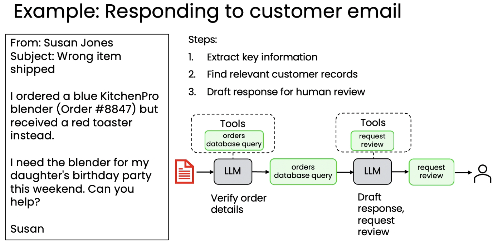

# 04. 에이전틱 AI 활용 사례 (Agentic AI applications)

> Module 1 · Lesson 4
> 이전 ← [03. 에이전틱 AI의 이점](03-benefits.md) · 다음 → [05. 작업 분해](05-task-decomposition.md)

## 한 줄 요약

난이도를 가르는 축은 두 개다: **절차가 미리 정해져 있는가**, 그리고 **입력이 텍스트뿐인가**.

---

## 난이도 순 4가지 사례

| # | 사례 | 난이도 | 왜 |
|---|---|---|---|
| 1 | 송장 처리 | 쉬움 | 절차가 명확히 정의됨 |
| 2 | 기본 주문 문의 응대 | 약간 어려움 | 절차는 명확하나 외부 조회 필요 |
| 3 | 일반 고객 서비스 | 어려움 | 필요한 단계가 미리 정해져 있지 않음 |
| 4 | 컴퓨터 사용 에이전트 | 가장 어려움 | 멀티모달 + 단계 미정 + 환경 불안정 |

---

## 1. 송장(인보이스) 처리 — 비교적 쉬움

**목표:** 송장에서 핵심 필드(청구자명, 청구자 주소, 청구 금액, 만기일)를 추출해 DB에 저장



```
송장 입력
  → PDF-투-텍스트 API로 변환 (예: 마크다운)
  → LLM이 해당 문서가 실제로 송장인지 확인
  → 맞으면 LLM이 필요한 필드 추출
  → LLM이 도구/API를 사용해 DB 업데이트
```

**쉬운 이유:** 명확하고 잘 정의된 절차를 단계별로 따르기만 하면 된다.

> 슬라이드에서 LLM(회색) 위에 붙은 점선 `Tools` 박스 안의 `update database`가
> 이 워크플로우에서 LLM이 가진 유일한 선택권이다.

## 2. 기본 고객 주문 문의 — 약간 더 어려움

**목표:** 고객이 주문한 내용에 대한 이메일 문의에 응답



```
이메일에서 주문 세부정보 추출
  → LLM이 주문 관련 이메일인지 확인
  → 주문 DB 조회
  → LLM이 답변 초안 작성
  → 발송 전 사람의 검토 대기열에 등록
```

여전히 명확하고 정해진 절차이며, 이런 에이전트는 **이미 많은 기업에서 배포되어 운영 중**이다.

> 마지막 단계가 "발송"이 아니라 **"사람 검토 요청"** 이라는 점에 주목.
> 자율성을 의도적으로 한 단계 낮춰 리스크를 통제하는 설계다.

## 3. 일반 고객 서비스 — 더 어려움

**목표:** 주문 관련 질문뿐 아니라 **임의의** 고객 질문 처리

예시 질의:

| 질의 | 필요한 작업 |
|---|---|
| "검정 청바지나 파란 청바지 있나요?" | 여러 차례의 순차적 DB/재고 확인 |
| "구매한 비치타월을 반품하고 싶어요" | 구매 여부 확인 → 반품 정책 확인(30일 이내, 미사용) → 승인 시 반품 전표 발급 → DB를 "반품 대기 중"으로 업데이트 |

**어려운 이유:** **필요한 단계들이 미리 정해져 있지 않다.**
LLM 기반 애플리케이션이 스스로 단계 순서를 파악하고 계획해야 한다.

## 4. 컴퓨터 사용 에이전트 — 가장 어려움

웹 브라우저로 페이지를 탐색하며 복잡한 작업을 완료하는 에이전트.
페이지 콘텐츠를 추론해 다음 행동을 결정한다.

**데모:** 샌프란시스코 → 워싱턴 D.C.(DCA) 유나이티드 항공 두 편의 좌석 가능 여부 확인

에이전트의 실제 행동 경로:
유나이티드 웹사이트 탐색 → 문제 발생 → **구글 플라이트로 전환** → 일치 옵션 발견 →
하나 선택 → 유나이티드 사이트로 복귀 → 좌석 가능 여부 확인

**현재 한계:** 로딩이 느린 페이지, 정확히 읽고 파싱하기 어려운 웹사이트에서 자주 실패.
아직 **미션 크리티컬한 용도에는 신뢰성이 부족**하지만, 발전이 기대되는 최첨단 연구 영역.

> 이 데모의 진짜 관전 포인트는 "성공"이 아니라 **막혔을 때 경로를 바꿨다**는 점이다.
> 그것이 자율성이 주는 값이자 동시에 예측 불가능성의 원천이다.

---

## 5. 무엇이 난이도를 가르는가

### 쉬워지는 경우

- 명확하고 **표준화된 단계별 절차**가 있는 경우
  (기존 비즈니스 절차를 코드화하는 데는 별도 노력이 들 수 있음)
- **텍스트 전용** 입력을 다루는 경우 — LLM은 텍스트 처리에서 가장 성숙함

### 어려워지는 경우

- 필요한 단계가 **미리 알려져 있지 않아** 에이전트가 진행하면서 동적으로 계획해야 하는 경우
  → 예측 불가능하고 신뢰성이 낮음
- **멀티모달 입력**(소리, 시각, 오디오)을 요구하는 경우 → 현재로선 텍스트 전용보다 신뢰성 낮음

> 프로젝트를 고를 때 이 두 축으로 먼저 점검하면, 착수 전에 난이도를 대략 가늠할 수 있다.

## 6. 다음 레슨 예고

**작업 분해(task decomposition)** — 복잡한 목표를 에이전틱 워크플로우로 구현하기 위한
개별 단계로 어떻게 나눌 것인가.
