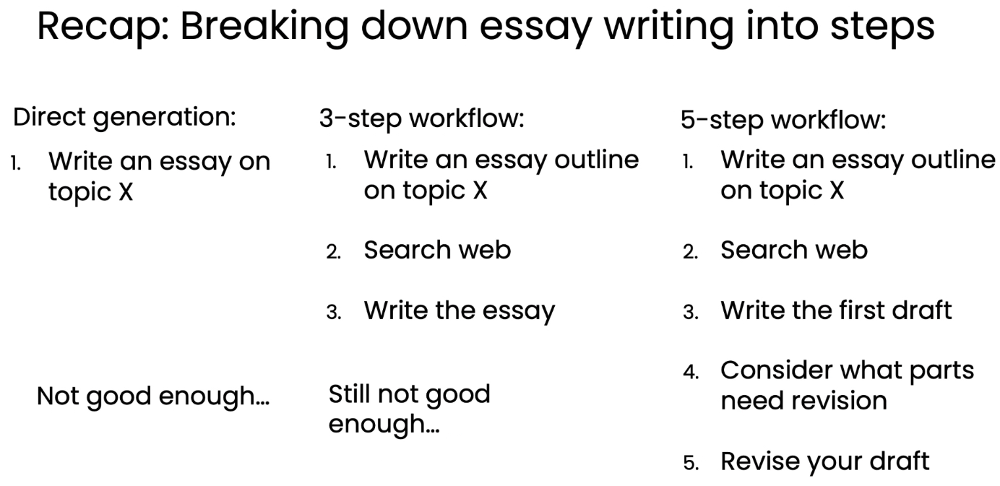
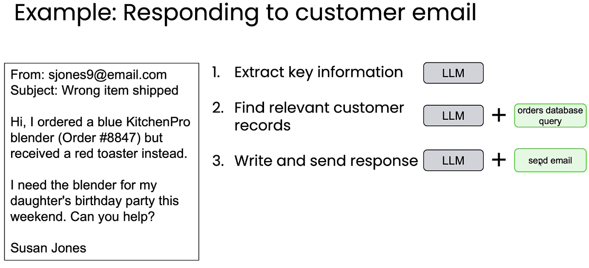
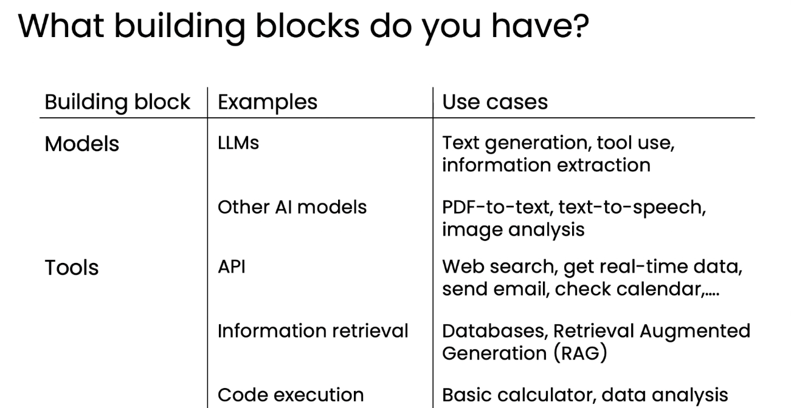

# 05. 작업 분해 — 워크플로우의 단계 식별하기 (Task decomposition)

> Module 1 · Lesson 5
> 이전 ← [04. 활용 사례](04-applications.md) · 다음 → [06. 평가(evals)](06-evals.md)

## 한 줄 요약

**"사람이라면 이걸 어떻게 할까?"** 를 묻고, 각 단계마다
**"이건 LLM이나 도구로 되나?"** 를 묻는다. 안 되면 더 쪼갠다. 그리고 반복한다.

이 강좌의 핵심 스킬이 바로 이 레슨에 있다.

---

## 1. 핵심 접근법

복잡한 작업을 에이전틱 단계로 분해하는 가장 유용한 방법:

> **"내가 사람이라면 실제로 이 작업을 어떻게 접근할까?"**

그리고 각 후보 단계마다 이렇게 묻는다:

> **"이 단계가 LLM, 짧은 코드 조각, 함수 호출, 또는 도구로 수행될 수 있는가?"**

## 2. 예시 1 — 리서치/에세이 작성 에이전트 (반복적 개선)

분해가 **한 번에 완성되지 않는다**는 것을 보여주는 가장 중요한 슬라이드다.

| 시도 | 워크플로우 | 결과 |
|---|---|---|
| **1차: 직접 생성** | 1. 주제 X로 에세이 작성 | 표면적이고 깊이 부족 → *Not good enough…* |
| **2차: 3단계** | 1. 아웃라인 작성 2. 웹 검색 3. 에세이 작성 | 나아졌지만 도입-중간-결론이 일관되게 이어지지 않음 → *Still not good enough…* |
| **3차: 5단계** | 1. 아웃라인 작성 2. 웹 검색 3. **초안 작성** 4. **수정이 필요한 부분 파악** 5. **초안 수정** | 사람이 자기 글을 자기 편집하는 방식과 동일 |

3차 시도에서 한 일은 **"에세이 작성"이라는 한 단계를 세 개의 하위 단계로 쪼갠 것**뿐이다.

**교훈:** 분해는 **반복적(iterative)** 이다.
간단하게 시작 → 결과 평가 → 성능이 부족한 단계를 더 세분화(또는 수정).

> 4~5단계가 곧 [리플렉션(Reflection) 패턴](07-design-patterns.md)이다.
> 모듈 2 전체가 이 두 단계를 깊게 파고든다.

## 3. 예시 2 — 고객 주문 문의 에이전트 (3단계)

| # | 단계 | 필요한 것 |
|---|---|---|
| 1 | 이메일에서 핵심 정보 추출 (발신자, 주문 내용, 주문 번호) | LLM |
| 2 | DB 쿼리로 관련 고객/주문 기록 조회 | LLM + `orders database query` 도구 |
| 3 | 답변 작성 및 발송 | LLM + `send email` 도구 |

이 표의 **오른쪽 열이 곧 구현 명세**다.
"LLM만으로 되는가, 도구가 필요한가"를 단계별로 못 박으면 그대로 코드 구조가 된다.

## 4. 예시 3 — 송장 처리 에이전트 (2단계)

| # | 단계 |
|---|---|
| 1 | 변환된 텍스트에서 필요한 필드(청구자명, 주소, 만기일, 청구 금액) 추출 |
| 2 | 추출된 정보를 확인하고 **함수 호출**을 통해 DB에 저장/업데이트 |

## 5. 사용할 수 있는 빌딩 블록

| 구분 | 빌딩 블록 | 용도 |
|---|---|---|
| **Models** | LLM / 대형 멀티모달 모델 | 텍스트 생성, 무엇을 호출할지 결정, 정보 추출 (멀티모달이면 이미지/오디오도) |
| | 특화된 AI 모델 | PDF-투-텍스트, 텍스트-투-스피치, 이미지 분석 |
| **Tools** | 소프트웨어 도구/API | 웹 검색, 실시간 날씨, 이메일 발송, 캘린더 확인 |
| | 정보 검색 | DB 조회, 대규모 텍스트에 대한 RAG(검색 증강 생성) |
| | 코드 실행 | LLM이 코드를 작성·실행 (기본 계산기부터 데이터 분석까지) |

핵심 역량은 **이 블록들을 어떤 순서로 조합할지** 파악하는 것이다.

## 6. 작업 분해 방법 요약

1. 사람/기업이 **현재 따르고 있는 개별 단계들**을 파악
2. 각 단계에 대해: **LLM이나 사용 가능한 도구(API/함수 호출)로 처리 가능한가?**
3. 아니라면: 사람이라면 이 단계를 어떻게 할지 생각하고, **더 작고 구현 가능한 하위 단계로 분해**
4. **반복(iteration)이 필요함을 예상**: 초기 워크플로우 구축 → 평가 → 원하는 성능까지 개선

## 7. 다음 레슨 예고

**평가(evals)** — 에이전틱 워크플로우를 평가하는 방법과,
이를 통해 성능을 지속적으로 개선하는 과정.
