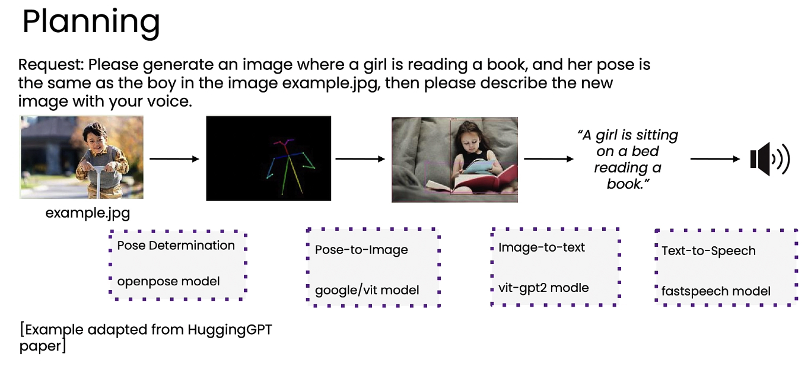

# 07. 에이전틱 디자인 패턴 (Agentic design patterns)

> Module 1 · Lesson 7 (모듈 1 마지막)
> 이전 ← [06. 평가(evals)](06-evals.md) · 인덱스 → [README](README.md)

## 한 줄 요약

강좌 전체를 지탱하는 4개 패턴: **리플렉션 · 도구 사용 · 계획 · 멀티 에이전트 협업.**
모듈 2~5가 각각 이 패턴 하나씩에 대응한다.

---

## 4가지 핵심 디자인 패턴

에이전틱 워크플로우는 빌딩 블록들을 다양한 방식으로 조합해 구축된다.
그 조합 방법의 대표적인 4가지 패턴:

| # | 패턴 | 한 줄 정의 | 강좌 모듈 |
|---|---|---|---|
| 1 | **리플렉션 (Reflection)** | LLM이 자기 출력을 스스로 비판하고 개선 | 모듈 2 |
| 2 | **도구 사용 (Tool Use)** | LLM이 외부 함수/도구를 호출 | 모듈 3 |
| 3 | **계획 (Planning)** | LLM이 단계 순서를 스스로 결정 | 모듈 5 |
| 4 | **멀티 에이전트 협업 (Multi-Agent)** | 역할이 다른 여러 에이전트가 협업 | 모듈 5 |

제어 난이도는 대체로 1 → 4 방향으로 올라간다.

---

## 1. 리플렉션 (Reflection)

LLM이 자신의 출력을 스스로 검토·비판한 뒤, 그 피드백으로 개선하는 방식.

**예시 흐름:**

```
LLM이 코드 작성
  → 그 코드를 다시 프롬프트에 넣고 "정확성·스타일·효율성 관점에서 비판하라"
  → 비판 내용을 피드백으로 제공하여 개선된 버전 생성
```

**피드백은 외부에서도 올 수 있다.**
실제로 코드를 실행해서 오류 메시지를 확인하면 반복 개선의 질이 올라간다.
(자기 판단보다 실행 결과가 훨씬 강한 신호다.)

**구현 형태 두 가지:**
- 하나의 LLM이 스스로를 비판
- **"코더" 에이전트와 "비평가" 에이전트** 두 개가 주고받는 형태

완벽하거나 마법 같은 해결책은 아니지만, 종종 의미 있는 성능 향상을 준다.

## 2. 도구 사용 (Tool Use)

LLM이 순수 텍스트 생성을 넘어서기 위해 외부 함수/도구를 호출한다.

| 예시 도구 | 해결하는 문제 |
|---|---|
| 웹 검색 도구 | 최신 정보 (예: 최고의 커피메이커 리뷰) |
| 코드 실행 도구 | 수학 계산 (예: 복리 계산) |

오늘날의 도구는 수학/데이터 분석, 웹·DB 정보 검색,
생산성 앱(이메일·캘린더) 연동, 이미지 처리 등을 아우른다.

**LLM이 어떤 도구를 호출할지 스스로 결정하게 함으로써** 수행 가능한 작업 범위가 크게 확장된다.

## 3. 계획 (Planning)

개발자가 단계 순서를 하드코딩하는 대신, **LLM이 스스로 행동 순서를 결정**한다.



**HuggingGPT 논문 예시**
요청: *"example.jpg 속 소년과 같은 포즈로 책 읽는 소녀 이미지를 생성하고, 그것을 음성으로 설명해줘"*

모델이 스스로 결정한 순서:

| # | 작업 | 사용 모델 |
|---|---|---|
| 1 | 참조 이미지에서 포즈 감지 (Pose Determination) | openpose |
| 2 | 해당 포즈로 새 이미지 생성 (Pose-to-Image) | google/vit |
| 3 | 이미지를 텍스트로 설명 (Image-to-text) | vit-gpt2 |
| 4 | 설명을 음성으로 변환 (Text-to-Speech) | fastspeech |

**이 API 호출 순서를 사람이 정해주지 않았다는 것이 핵심이다.**

계획형 에이전트는 제어가 더 어렵고 다소 실험적이지만, 인상적인 결과를 낼 수 있다.

## 4. 멀티 에이전트 협업 (Multi-Agent Collaboration)

사람 관리자가 서로 다른 전문 역할의 팀원을 모으듯,
각기 다른 역할을 맡은 여러 에이전트가 복잡한 작업에서 협업한다.

**예시:**
- **ChatDev** — CEO, 프로그래머, 테스터, 디자이너 역할의 에이전트들이 협업해 소프트웨어 개발
- 마케팅 브로슈어 작성 — 리서처 에이전트 + 마케터 에이전트 + 에디터 에이전트

에이전트 행동을 미리 완전히 예측할 수 없어 제어는 더 어렵다.
그러나 연구에 따르면 전기문 작성, 체스 수 결정 같은 복잡한 작업에서
**더 나은 결과**를 가져올 수 있다.

---

## 모듈 1 마무리

에이전틱 워크플로우 구축이란 결국:

1. 적절한 **빌딩 블록**을 파악하고
2. 이 **디자인 패턴**들을 활용해 조합하며
3. 성능을 측정·개선할 **평가(evals)** 를 개발하는 것

다음 모듈에서는 **리플렉션(Reflection)** 패턴을 깊이 다룬다.
구현이 놀라울 정도로 간단하면서도 종종 상당한 성능 향상을 주는 기법으로 소개된다.
