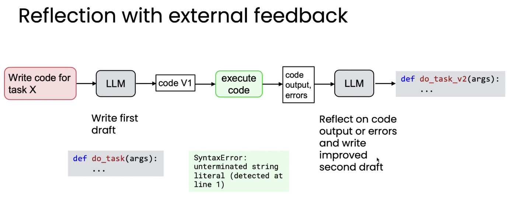

# 01. 리플렉션으로 결과물 개선하기 (Reflection to improve outputs of a task)

> Module 2 · Lesson 1
> 다음 → [02. 왜 직접 생성으로는 부족한가](02-why-not-direct-generation.md)

## 한 줄 요약

LLM에게 자기 출력을 검토·수정하게 하면 품질이 오른다.
그리고 **외부 정보를 함께 넣어줄 수 있을 때 훨씬 더 강력해진다.**

---

## 1. 리플렉션(Reflection)이란

사람이 자기 글을 검토하고 고치는 것과 같습니다.

> 이메일 초안을 급히 쓴다 → 읽어보니 불명확하고 오타가 있다 → 더 명확하고 구체적으로 고친다

LLM도 같은 방식으로 프롬프트할 수 있습니다.

## 2. 기본 워크플로우

```
LLM ──→ 초안 v1 ──→ (같은 또는 다른) LLM ──→ 개선된 v2
                     "검토하고 개선하라"
```

이메일뿐 아니라 **코드에도 동일하게 적용**됩니다. 코드 초안을 생성한 뒤, 버그를 확인하고 개선된 버전을 쓰도록 요청하면 됩니다.

## 3. 단계별로 다른 모델 쓰기

LLM마다 강점이 다릅니다.

| 단계 | 적합한 모델 |
|---|---|
| 초안 생성 | 일반 모델 (직접 생성) |
| 검토·버그 확인 | **추론(reasoning) 모델** |

추론 모델은 버그를 찾는 데 특히 강한 경향이 있어, 생성은 일반 모델로 하고 **검토 단계에만 추론 모델을 쓰는 조합**이 흔히 사용됩니다.

> 모듈 1에서 만든 [리서치 에이전트](../../projects/research-agent/README.md)의 비평 단계도
> 같은 이유로 모델을 갈아끼울 수 있게 열어뒀습니다.

## 4. 외부 피드백이 있을 때 훨씬 강력해진다



```
"task X 코드 작성" → LLM → code V1 → execute code → 출력·오류
                                                       ↓
                                     do_task_v2  ←── LLM (오류를 보고 검토)
```

그림에서 **초록 박스(`execute code`)가 핵심**입니다. 자기 출력을 혼자 다시 읽는 것과, **실제로 실행해서 나온 오류 메시지**를 보는 것은 정보량이 다릅니다.

영상의 예시에서는 v1 코드를 실행하니 이런 오류가 나왔습니다:

```
SyntaxError: unterminated string literal (detected at line 1)
```

이 로그를 다시 넣어주자 훨씬 개선된 v2가 나왔습니다. **모델이 몰랐던 새 정보가 들어간 것**입니다.

## 5. 핵심 요점과 한계

- 리플렉션은 **마법이 아닙니다.** 100% 정확하게 만들어주지 않습니다
- 다만 **적당한 수준의 성능 향상**은 꾸준히 제공합니다
- 설계 원칙: **자체 검토에만 의존하지 말고, 외부 정보를 넣을 기회를 찾을 것**

> 이 마지막 문장이 모듈 2 전체의 주제입니다.
> [06번 노트](06-using-external-feedback.md)에서 정면으로 다룹니다.

## 6. 다음 레슨 예고

리플렉션과 직접 생성(제로샷 프롬프팅)의 체계적인 비교.
