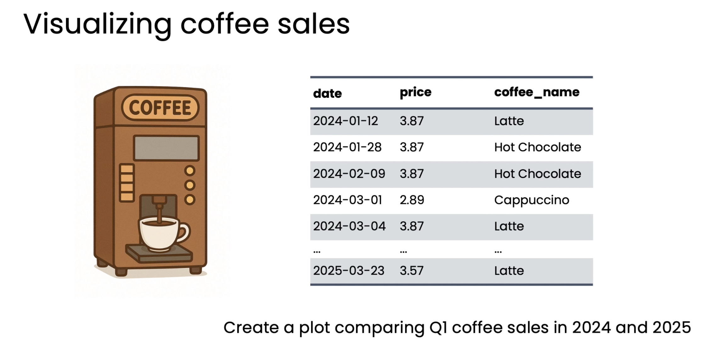
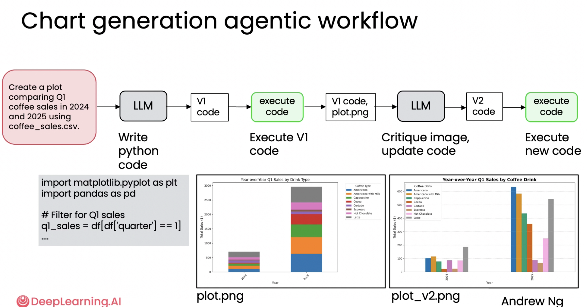

# 03. 차트 생성 워크플로우 (Chart generation workflow)

> Module 2 · Lesson 3
> 이전 ← [02. 왜 직접 생성으로는 부족한가](02-why-not-direct-generation.md) · 다음 → [04. Ungraded Lab: Chart Generation](04-lab-chart-generation.md)

## 한 줄 요약

**멀티모달 LLM에게 생성된 이미지를 직접 보여주고 비평하게 한다.**
코드만 읽는 것과 결과 그림을 보는 것은 다르다.

---

## 1. 과제



CSV 스프레드시트(`coffee_sales.csv`)를 받아, **2024년과 2025년의 1분기 커피 판매를 비교하는 플롯**을 생성하는 작업입니다. 라떼, 핫초코, 카푸치노 등의 음료가 들어 있습니다.

## 2. 전체 워크플로우



```
"CSV로 Q1 커피 판매 비교 플롯 생성"
  → LLM        (파이썬 코드 작성)         → V1 code
  → execute    (V1 실행)                 → V1 code, plot.png
  → LLM        (이미지 비평, 코드 수정)    → V2 code
  → execute    (새 코드 실행)             → plot_v2.png
```

**초록 박스가 두 번 등장**하는 것에 주목하세요. [모듈 1의 색상 규칙](../module-1-agentic-workflows/02-degrees-of-autonomy.md)대로 도구 호출이고, 여기서는 코드 실행입니다.

## 3. 1차 시도(v1) — 그다지 좋지 않음

v1 코드를 실행하니 **누적 막대 그래프(stacked bar plot)** 가 나왔습니다.

그림 왼쪽 `plot.png`를 보면 2024와 2025 두 막대에 8종의 음료가 층층이 쌓여 있습니다. 연도별 총합은 보이지만 **음료별 비교가 불가능**합니다. 읽기 어렵고 보기에도 좋지 않습니다.

## 4. 멀티모달 LLM으로 리플렉션 적용

핵심은 여기입니다.

> **v1 코드와 생성된 이미지를 함께** 멀티모달 LLM(이미지 입력을 받는 모델)에 입력한다.

모델에게 플롯을 **시각적으로 검토**하고, 비평한 뒤, 더 명확한 시각화를 위해 코드를 수정하라고 요청합니다. 멀티모달 LLM은 **시각적 추론(visual reasoning)** 을 할 수 있어 실제로 그림을 보고 개선점을 찾습니다.

**결과:** 누적이 아닌 일반 막대 그래프(`plot_v2.png`). 2024와 2025의 음료별 판매가 나란히 배치되어 비교가 가능해졌습니다.

> 코드만 읽었다면 "누적 막대가 부적절하다"를 알기 어렵습니다.
> `plt.bar(..., bottom=...)` 는 문법적으로 아무 문제가 없기 때문입니다.
> **그림을 봐야 보이는 결함**이라는 점이 이 레슨의 요점입니다.

## 5. 생성과 검토에 서로 다른 모델 쓰기

검토 프롬프트 구성 방식:

1. LLM에게 **"건설적 피드백을 주는 전문 데이터 분석가"** 역할 부여
2. v1 코드(가능하면 생성 이력도) 제공
3. **구체적 기준**으로 비평하게 함 — 가독성, 명확성, 완성도
4. 그 후 개선된 코드 작성

명확한 기준을 주는 것이 비판의 방향을 잡아줍니다. 그리고 **추론(reasoning) 모델이 검토 단계에서 더 나은 성능**을 보이는 경우가 있습니다.

## 6. 효과는 애플리케이션마다 다르다

연구에 따르면 리플렉션의 효과는 작업에 따라 갈립니다:

| 정도 | |
|---|---|
| 크게 향상 | 일부 작업 |
| 미미하게 향상 | 일부 작업 |
| 거의 효과 없음 | 일부 작업 |

따라서 **내 애플리케이션에서 실제로 어떤지 테스트**하고, 초기 생성 프롬프트나 검토 프롬프트를 조정해야 합니다.

## 7. 다음 레슨 예고

리플렉션 워크플로우에 대한 **평가(evals)**.
