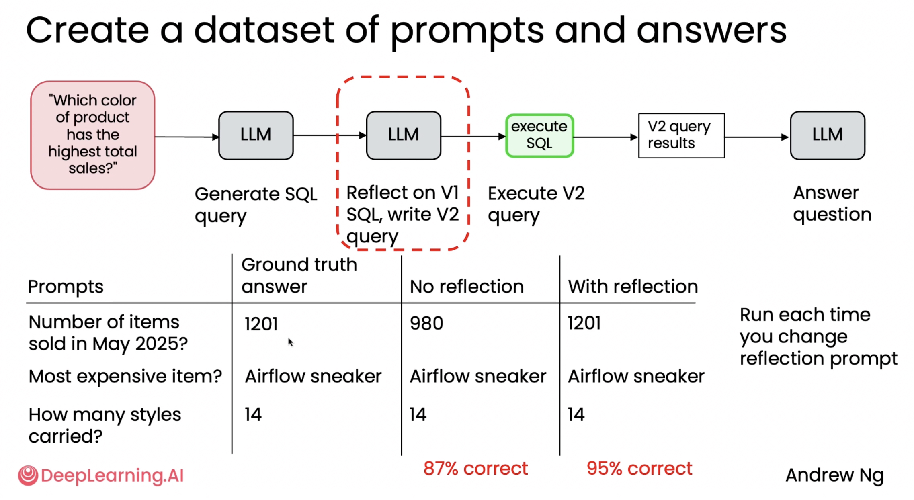
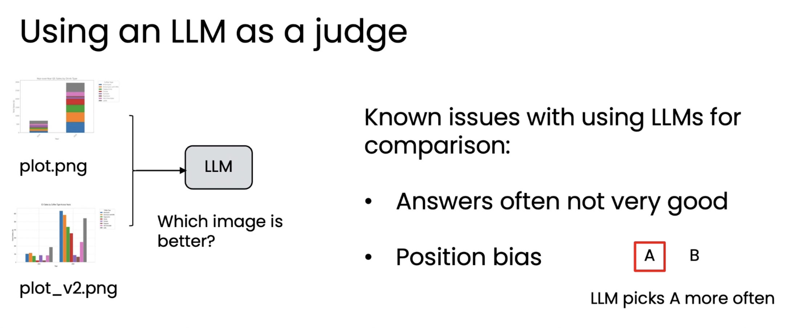
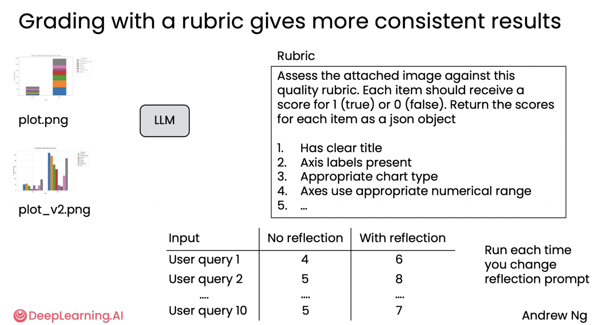

# 05. 리플렉션의 효과 평가하기 (Evaluating the impact of reflection)

> Module 2 · Lesson 5
> 이전 ← [04. Ungraded Lab: Chart Generation](04-lab-chart-generation.md) · 다음 → [06. 외부 피드백 활용하기](06-using-external-feedback.md)

## 한 줄 요약

리플렉션은 **공짜가 아니다** — 단계가 늘고 느려진다.
그러니 **정말 좋아지는지 재보고** 결정하라.

---

## 1. 왜 먼저 평가하는가

리플렉션을 넣으면:

- LLM 호출이 최소 1회 이상 늘어난다
- 지연 시간과 비용이 증가한다
- 워크플로우가 복잡해진다

그러므로 **"유지할 가치가 있는가"** 를 확인하고 결정해야 합니다. 감이 아니라 숫자로.

## 2. 객관적 평가 — DB 쿼리 생성



**작업:** "총 판매량이 가장 높은 색상 제품은?" 같은 질문에 답하는 SQL을 LLM이 작성

```
질문 → LLM (v1 쿼리 생성)
     → LLM (검토: 쿼리 점검·개선)   ← 이 단계가 평가 대상
     → DB 실행 → 최종 답변
```

**평가 방법:**

1. **정답(ground truth)이 알려진 질문 10~15개**를 수집
   예: "2025년 5월에 몇 개의 상품이 판매되었나요?" → 정답 알고 있음
2. 리플렉션 **없이** 워크플로우 전체 실행 → 정답률 측정
3. 리플렉션 **적용**해서 실행 → 정답률 측정
4. 두 숫자를 비교

**결과:**

| 조건 | 정답률 |
|---|---|
| 리플렉션 없음 | 87% |
| 리플렉션 적용 | **95%** |

이 경우 리플렉션은 정확도를 **의미 있게** 향상시켰습니다.

**부가 효과:** 이런 평가가 한 번 마련되면, 프롬프트를 바꿔볼 때마다 재실행해서 어떤 버전이 나은지 바로 잴 수 있습니다. 그림에도 이렇게 적혀 있습니다 — *"Run each time you change reflection prompt"*.

> 명확한 정답이 존재하므로 이는 **객관적 평가(objective eval)** 입니다.
> 모듈 1의 [평가(evals) 노트](../module-1-agentic-workflows/06-evals.md)에서 본
> "셀 수 있는 것부터 세라"와 같은 원칙입니다.

## 3. 주관적 평가 — 차트 품질

DB 답변과 달리, **어떤 플롯이 더 나은가**는 흑백으로 갈리지 않습니다.

### 순진한 접근: 두 이미지를 놓고 물어보기



두 이미지를 멀티모달 LLM에 넣고 "어느 쪽이 나은가?"라고 묻는 방식입니다.
**잘 작동하지 않습니다.**

| 문제 | 내용 |
|---|---|
| 프롬프트 민감성 | 표현을 조금만 바꿔도 결과가 달라짐 |
| 사람 판단과 불일치 | 순위가 전문가 판단과 잘 맞지 않음 |
| **위치 편향(position bias)** | **먼저 제시된 쪽을 더 자주 고름.** 일부 모델은 두 번째를 선호하지만 첫 번째 편향이 더 흔함 |

> 위치 편향은 특히 위험합니다.
> "리플렉션 후 결과를 항상 두 번째에 놓는" 실험 설계라면,
> **리플렉션의 효과를 체계적으로 과소평가**하게 됩니다.

### 더 나은 접근: 루브릭 기반 채점



두 이미지를 **비교하지 말고**, **한 장씩** 명시적 기준표로 채점합니다.

그림의 루브릭 지시문:

> *"Each item should receive a score for 1 (true) or 0 (false).*
> *Return the scores for each item as a json object"*

기준 예시:

1. 명확한 제목이 있는가
2. 축 레이블이 있는가
3. 적절한 차트 유형인가
4. 축의 수치 범위가 적절한가

**핵심 설계:** 1~5점 척도로 물으면 LLM은 **보정(calibration)이 잘 안 됩니다.**
대신 **여러 개의 이진(예/아니오) 기준을 합산**하세요 — 5개 기준이면 5점 만점, 10개면 10점 만점. 훨씬 일관된 결과가 나옵니다.

**결과 예시** (리플렉션 전 → 리플렉션 후):

| 샘플 | 리플렉션 전 | 리플렉션 후 |
|---|---|---|
| 1 | 4 | 6 |
| 2 | 5 | 8 |
| 3 | 5 | 7 |

## 4. 객관적 vs. 주관적 — 일반 원칙

| | 평가 방식 | 난이도 |
|---|---|---|
| **객관적 기준**<br>(정답/오답이 명확) | 코드 기반 평가. 정답 데이터셋 구축 후 정확도 측정 | 관리하기 쉬움 |
| **주관적 기준**<br>(품질·선호) | LLM-as-judge. 좋은 루브릭 설계가 관건 | 튜닝이 더 필요 |

> **[OPINION]** 가능하면 주관적 문제를 객관적 체크로 쪼개는 쪽이 낫습니다.
> "차트가 좋은가?"는 주관적이지만 "제목이 있는가?"는 객관적입니다.
> 루브릭 채점이 하는 일이 정확히 이 분해입니다.

## 5. 모듈 1 리서치 에이전트와 비교

모듈 1에서 만든 [리서치 에이전트](../../projects/research-agent/README.md)의 `evals.py`는 이미 이 원칙을 따르고 있습니다:

| 이 레슨의 개념 | 리서치 에이전트에서의 구현 |
|---|---|
| 이진 기준 합산 | 8개 체크, 각각 pass/fail → 8점 만점 |
| 객관적 우선 | 인용 URL 대조, 링크 생존, 출처 다양성 — LLM 판정 없음 |
| 리플렉션 전/후 비교 | `draft` vs `report` 를 같은 체크로 채점 |
| 프롬프트 변경 시 재실행 | 가독성 규칙 튜닝할 때마다 재측정 (-9.7 → 40.0) |

📌 아직 없는 것: **정답 데이터셋(ground truth)**. 리서치 리포트는 정답이 없어서 이 레슨의 87%↔95% 같은 비교를 만들기 어렵습니다. SQL 랩이 이 부분을 다루는 것으로 보입니다.

## 6. 다음 레슨 예고

**추가적인 외부 정보**를 도입해 리플렉션 워크플로우를 더 효과적으로 만드는 법.
