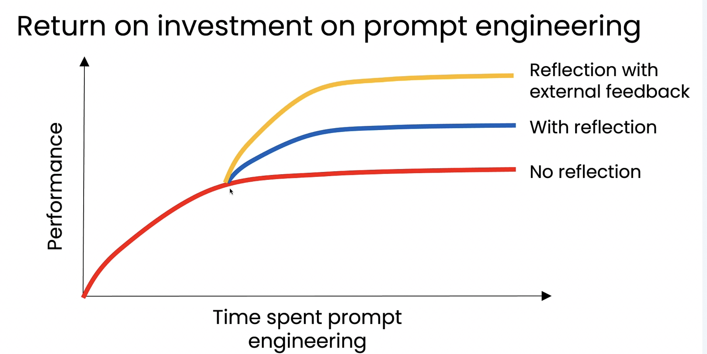
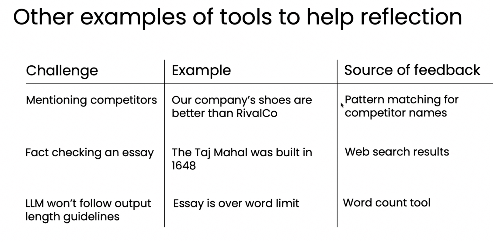

# 06. 외부 피드백 활용하기 (Using external feedback)

> Module 2 · Lesson 6
> 이전 ← [05. 리플렉션의 효과 평가하기](05-evaluating-reflection.md) · 다음 → [07. Ungraded Lab: Improving SQL Generation with Reflection](07-lab-sql-reflection.md)

## 한 줄 요약

프롬프트 튜닝은 **정체기(plateau)** 에 도달한다.
자체 검토는 조금 더 올려주고, **외부 피드백은 그보다 훨씬 더 올려준다.**

---

## 1. 세 개의 곡선



가로축은 **프롬프트 엔지니어링에 들인 노력**, 세로축은 **성능**입니다.

| 곡선 | 방식 | 도달 지점 |
|---|---|---|
| 🔴 빨강 | 리플렉션 없음 (직접 생성만) | 가장 먼저 정체 |
| 🔵 파랑 | 리플렉션 적용 | 한 단계 위에서 정체 |
| 🟡 노랑 | 리플렉션 + **외부 피드백** | **가장 높은 수준** |

**중요한 것은 세 곡선이 언제 갈라지는가입니다.**
초반에는 셋이 거의 같습니다. 프롬프트만 다듬어도 성능이 오르니까요.
**차이는 정체 시점 이후에 벌어집니다.**

## 2. 실용적 조언

> 프롬프트 엔지니어링의 **수익이 줄어드는 게 느껴지면**,
> 리플렉션을 추가하고, 가능하면 **외부 피드백**까지 추가해 정체를 돌파하라.

역으로: 아직 프롬프트만으로 성능이 쭉쭉 오르는 단계라면 **리플렉션을 넣을 때가 아닙니다.**
복잡성만 늘어납니다.

## 3. 복습 — 코드 실행이 곧 외부 피드백

[01번 노트](01-reflection-basics.md)에서 본 예시가 이미 이 패턴입니다.

```
코드 v1 → 실행 → SyntaxError 로그 → 검토 LLM에 입력 → 코드 v2
```

오류 로그는 **모델이 갖고 있지 않던 새 정보**입니다.
반면 "네 코드를 다시 읽어봐"는 새 정보가 0입니다.

## 4. 외부 피드백 소스의 다른 예시들



| 과제 | 상황 | 피드백 소스 |
|---|---|---|
| **경쟁사 이름 탐지** | LLM이 쓴 마케팅 이메일에 경쟁사 이름이 섞임 | **패턴 매칭**(정규표현식)으로 스캔 → 발견되면 구체적 비판으로 되먹여 재작성 |
| **사실 확인** | "타지마할은 1648년에 지어졌다" | **웹 검색** → 실제로는 1631년 착공, 1648년 완공. 이 정보를 검토 단계에 주입 |
| **단어 수 제한** | 블로그/초록의 단어 수 제한 초과 | **단어 수 계산 도구** → 초과분을 알려주고 맞을 때까지 수정 |

### 공통 패턴

세 사례 모두 구조가 같습니다.

```
초기 출력 → [코드/도구] → 출력에 대한 "추가적인 사실"
                              ↓
                          검토 LLM → 개선된 출력
```

**코드나 도구가 사실을 캐내고, LLM은 그 사실을 받아 고칩니다.**
자체 검토만으로는 나올 수 없는 개선입니다.

> LLM은 자기 글의 단어 수를 정확히 세지 못합니다.
> 반면 `len(text.split())` 은 항상 맞습니다.
> **"LLM이 못하는 것을 코드가 대신 확인"** — 이것이 외부 피드백의 본질입니다.

## 5. 모듈 1 리서치 에이전트에 이미 있던 것

| 외부 피드백 소스 | 리서치 에이전트에서 |
|---|---|
| 웹 검색으로 사실 확인 | `search_web` / `search_arxiv` 로 수집한 원문을 비평 단계에 함께 전달 |
| 코드 기반 사실 확인 | `evals.py` 의 인용 URL 대조 — 모델이 지어낸 URL을 코드가 잡아냄 |
| 링크 생존 확인 | HTTP GET 으로 죽은 링크 판별 |

📌 아직 안 한 것: **eval 결과를 검토 단계에 되먹이지 않습니다.** 지금은 실행이 끝난 뒤 사람이 보는 점수일 뿐입니다. 이 레슨대로라면 **eval 실패를 비평 프롬프트에 넣어 자동 재작성**하게 만드는 것이 다음 단계입니다.

## 6. 마무리 및 다음 모듈 예고

- 리플렉션은 강력하며 **폭넓게 적용해볼 가치**가 있음
- 다음 모듈: **도구 사용(tool use)** — 에이전트가 다양한 함수를 체계적으로 호출하게 만드는 법

> 흐름이 자연스럽게 이어집니다.
> 이번 모듈의 결론이 "외부 정보를 끌어오면 강해진다"였고,
> **그 외부 정보를 끌어오는 체계적인 방법이 곧 도구 사용**입니다.
