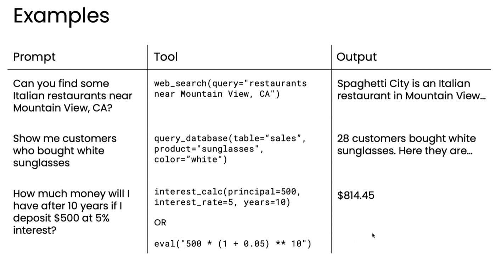
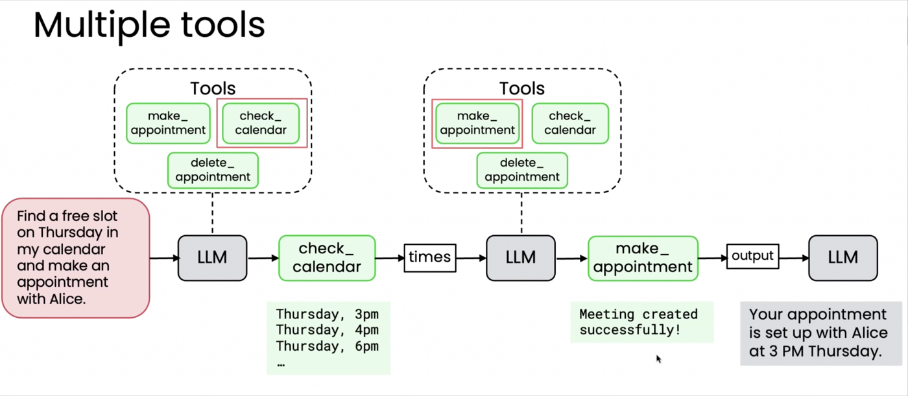

# 01. 도구란 무엇인가 (What are tools?)

> Module 3 · Lesson 1
> 다음 → [02. 도구 만들기](02-creating-a-tool.md)

## 한 줄 요약

**LLM이 함수를 호출할지 말지를 스스로 결정하게 하는 것**이 도구 사용입니다.
하드코딩된 워크플로우와 갈라지는 지점이 바로 이 "스스로 결정"입니다.

---

## 1. 도구 사용(Tool Use)이란

도구가 사람이 할 수 있는 일을 넓혀주듯, LLM에게 함수 접근 권한을 주면 LLM이 할 수 있는
일도 넓어집니다.

**대표 예시 — 현재 시각**

몇 달 전에 학습된 LLM은 지금 몇 시인지 알 방법이 없습니다. 학습 데이터에 없으니까요.
그런데 `get_current_time` 함수에 접근할 수 있다면 그것을 호출해 정확히 답할 수 있습니다.

## 2. 작동 방식 — 5단계

```
① 입력 프롬프트가 LLM 에게 주어진다
② LLM 이 사용 가능한 도구 목록을 보고 호출할지 결정한다
③ 도구(함수)를 호출하면 값이 반환된다
④ 그 값이 대화 기록(conversation history)에 다시 들어간다
⑤ LLM 이 새 정보를 써서 최종 출력을 만든다
```

**④가 핵심입니다.** 함수의 반환값이 대화 기록에 추가되고, LLM은 그 위에서 이어 씁니다.

## 3. 호출 여부는 LLM이 정한다

도구 사용은 하드코딩이 아닙니다.

> *"녹차에 카페인이 얼마나 들어있나요?"*

이 질문에 `get_current_time`은 필요 없습니다. LLM은 도구를 부르지 않고 바로 답합니다.

> 📌 실제로 확인했습니다. 같은 도구를 준 채 이 질문을 던지면 응답이 이렇게 옵니다.
> ```
> finish_reason : "stop"     tool_calls : None
> ```
> 응답 구조에 그대로 드러납니다 — [02번 §5](02-creating-a-tool.md)

**모듈 1·2와 갈라지는 지점입니다.**

| | 결정 주체 | 예 |
|---|---|---|
| 하드코딩 워크플로우 | **개발자** | "3단계에서 항상 웹 검색" |
| **도구 사용** | **LLM** | "이 질문엔 검색이 필요한가?" |

> 강사는 다이어그램에서 **점선 박스(dashed box)** 로 "LLM이 골라 쓸 수 있게 제공된 도구들"을
> 표시합니다. 실선 화살표(반드시 거치는 단계)와 구분됩니다.

## 4. 쓸모 있는 예시들

| 요청 | LLM 이 부르는 도구 |
|---|---|
| *"마운틴뷰 근처 이탈리안 레스토랑 찾아줘"* | 웹 검색 |
| *"흰색 선글라스를 산 고객 보여줘"* | 데이터베이스 조회 |
| *"500달러를 10년간 연 5%로 예치하면?"* | 이자 계산 (또는 코드 작성·실행) |



강의 슬라이드는 각 예시의 **실제 호출 형태**까지 보여줍니다.

```
web_search(query="restaurants near Mountain View, CA")
query_database(table="sales", product="sunglasses", color="white")
interest_calc(principal=500, interest_rate=5, years=10)
   또는  eval("500 * (1 + 0.05) ** 10")
```

마지막 줄이 [06번 코드 실행](06-code-execution.md)의 예고입니다 — 전용 도구를 만들 수도,
**코드를 쓰게 할 수도** 있습니다.

**개발자가 할 일**은 애플리케이션이 지원해야 할 작업을 정하고, 그에 맞는 함수를 만들어
LLM이 쓸 수 있게 제공하는 것입니다.

## 5. 도구가 여러 개일 때 — 캘린더 비서

> *"목요일에 빈 시간을 찾아서 Alice와 약속을 잡아줘"*

사용 가능한 도구: **약속 생성** · **캘린더 확인** · **약속 삭제**



```
LLM → 캘린더 확인 호출        "목요일 오후 3시가 비어 있음"
    → 시간대 결정 (오후 3시)
    → 약속 생성 호출          초대장 발송
    → 확인 응답 수신
    → "목요일 오후 3시에 Alice 와 약속이 설정되었습니다"
```

**어떤 도구를 어떤 순서로 쓸지까지 LLM이 정합니다.** 개발자는 도구를 제공했을 뿐입니다.

## 6. 왜 중요한가

LLM에게 도구를 주는 것은 애플리케이션이 할 수 있는 일을 크게 넓힙니다.
모듈 2에서 다룬 **외부 피드백**([06번](../module-2-reflection/06-using-external-feedback.md))도
결국 도구가 가져온 정보를 되먹이는 것이었습니다.

---

**다음 →** [02. 도구 만들기](02-creating-a-tool.md) — LLM은 실제로 함수를 실행하지 못하는데,
그러면 "호출"은 어떻게 일어나는가?
