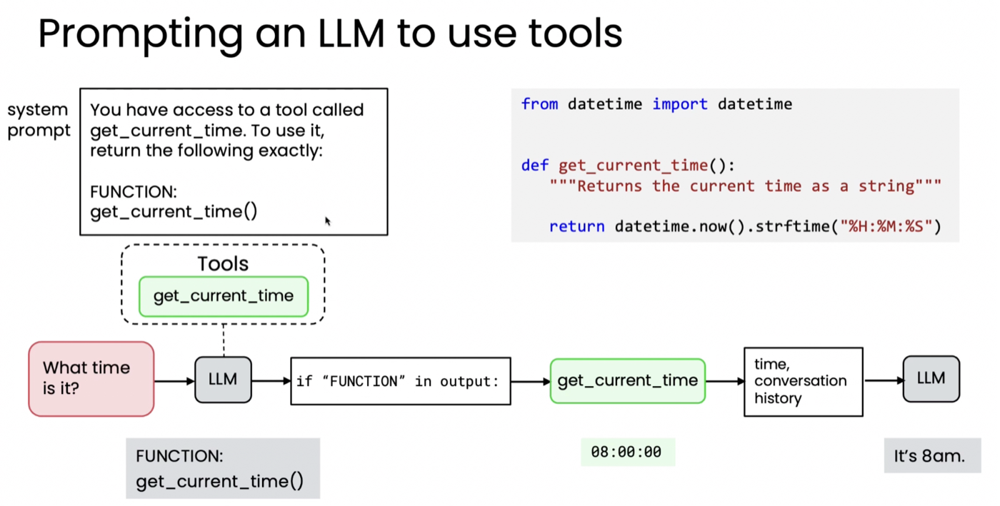
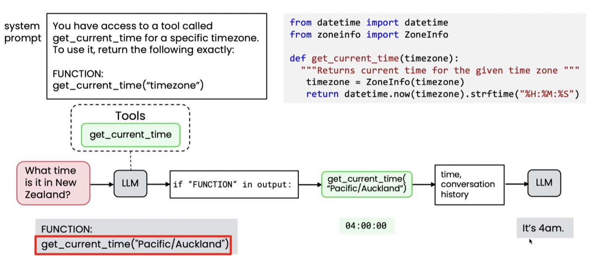

# 02. 도구 만들기 (Creating a tool)

> Module 3 · Lesson 2
> 이전 → [01. 도구란 무엇인가](01-what-are-tools.md) · 다음 → [03. 도구 문법](03-tool-syntax.md)

## 한 줄 요약

**LLM은 함수를 실행하지 않습니다.** 특정 형식의 텍스트를 출력할 뿐이고,
그것을 보고 **개발자의 코드가 대신 함수를 부릅니다.**

---

## 1. 질문 — LLM은 어떻게 함수를 "호출"하는가

LLM이 하는 일은 토큰을 생성하는 것뿐입니다. 파이썬 함수를 실행할 능력이 없습니다.
그런데 앞 레슨에서는 "LLM이 도구를 호출한다"고 했습니다. 무슨 뜻일까요?

> 이 레슨은 LLM이 도구 사용을 위해 **네이티브로 학습되기 전** 시대의 방식을 보여줍니다.
> 현대 모델은 이 방식이 필요 없지만, **개념을 이해하는 데는 이쪽이 훨씬 명확합니다.**

## 2. 예전 방식 — 약속된 마커 출력하기

시스템 프롬프트로 이렇게 알려줍니다.

```
You have access to a tool called get_current_time.
To use it, return the following exactly:

FUNCTION: get_current_time()
```



사용자가 *"지금 몇 시야?"* 라고 물으면, LLM은 함수를 부르는 대신 **그 텍스트를 출력**합니다.

```
FUNCTION: get_current_time()
```

**그다음은 개발자 코드의 일입니다.**

```python
if "FUNCTION" in output:      # ① 특수 패턴을 찾고
    ...                       # ② 어떤 함수인지 추출하고
    result = get_current_time()   # ③ 실제로 호출하고 → "08:00:00"
    # ④ 결과를 대화 기록에 추가
```

그러면 LLM이 새 정보로 최종 답을 만듭니다 — *"지금은 오전 8시입니다."*

> **핵심:** LLM은 함수를 직접 부르지 않습니다. **"불러달라"는 신호를 텍스트로 낼 뿐**이고,
> 실행과 되먹임은 전부 개발자 코드가 합니다.

## 3. 인자가 있는 함수

`get_current_time`이 **시간대 인자**를 받도록 확장하면, 시스템 프롬프트가 형식을 알려줍니다.

```
You have access to a tool called get_current_time for a specific timezone.
To use it, return the following exactly:

FUNCTION: get_current_time("timezone")
```

*"뉴질랜드는 지금 몇 시야?"* 에 LLM은 이렇게 출력합니다.

```
FUNCTION: get_current_time("Pacific/Auckland")
```



과정은 같습니다 — 패턴 감지 → **인자 추출** → 호출 → 결과(`04:00:00`) 되먹임 →
*"It's 4am."*

> 인자로 넘어간 `"Pacific/Auckland"` 는 **IANA 시간대 문자열**입니다.
> [03번](03-tool-syntax.md)에서 이 형식을 모델에게 어떻게 알려주는지가 나옵니다.

## 4. 일반적인 프로세스

```
① 도구를 제공한다        함수를 구현하고, 쓸 수 있다고 LLM 에게 알린다
② LLM 이 요청 신호를 낸다  약속된 형식의 출력
③ 개발자 코드가 실행한다   실제 함수 호출 + 출력 수집
④ 결과를 되먹인다        대화 기록에 추가
⑤ LLM 이 이어간다        최종 응답, 또는 다음 도구 호출 → ②로 반복
```

**⑤의 "반복"이 에이전트 루프입니다.** 캘린더 예시에서 도구를 두 번 부른 것이 이 반복입니다.

## 5. 예전 방식 vs 현대 방식

`FUNCTION:` 같은 대문자 텍스트 규약은 모델이 도구 사용을 학습하기 전의 우회책이었습니다.
현대 모델은 도구 호출을 명확히 요청하는 **표준화된 문법**을 쓰도록 학습되어 있습니다.

| | 예전 (`FUNCTION:` 텍스트) | 현대 |
|---|---|---|
| 호출 신호 | 본문 텍스트에 섞여 나옴 | **별도 필드**(`tool_calls`)로 분리 |
| 감지 | `if "FUNCTION" in output` | `finish_reason == "tool_calls"` |
| 인자 | 문자열을 직접 파싱 | **JSON 문자열**로 도착 |
| 결과 되먹임 | 대화에 텍스트로 덧붙임 | `role: "tool"` 메시지 |
| 실패 지점 | 모델이 형식을 틀리면 깨짐 | 형식은 API 가 보장 |

### 실제로 확인한 응답 구조

> 📌 아래는 **직접 호출해 확인한 것**입니다. 강의 슬라이드에는 없고,
> [03번](03-tool-syntax.md)의 aisuite 가 감춰주는 층이기도 합니다.
> 무엇이 감춰지는지 알아야 문제가 생겼을 때 볼 곳을 압니다.

**① 1차 호출 — 모델이 도구를 요청한다**

```python
r = client.chat.completions.create(model="gpt-4.1", messages=messages, tools=tools)
```

```
finish_reason : "tool_calls"          ← 텍스트 파싱이 아니라 상태값
content       : None                  ← 본문이 아예 비어 있다
tool_calls[0] : id   = "call_cTGks3mykOeJEQWQMXvldrrS"
                type = "function"
                name = "get_current_time"
                args = '{"timezone":"Pacific/Auckland"}'    ← JSON 문자열
```

**`content`가 `None`이라는 점이 예전 방식과의 결정적 차이입니다.** 예전엔 답변 텍스트 속에서
마커를 찾아내야 했지만, 이제는 **호출 요청이 별도 필드로 분리돼** 옵니다.

> 질문은 *"What time is it in New Zealand?"* 였는데 모델이 `"Pacific/Auckland"` 를 넣었습니다.
> 스키마의 파라미터 설명에 *"The IANA time zone string"* 이라고 적어둔 결과입니다 —
> [03번](03-tool-syntax.md)에서 docstring 이 왜 중요한지의 실물입니다.

**② 개발자 코드가 실행한다**

```python
args = json.loads(tool_call.function.arguments)
result = get_current_time(**args)          # → "01:52:50"
```

여전히 **실행은 우리 몫입니다.** 모델은 "불러달라"고 했을 뿐입니다.

**③ 결과를 되먹인다 — `role: "tool"`**

```python
messages.append(assistant_message)                    # 도구를 요청한 그 메시지
messages.append({
    "role": "tool",
    "tool_call_id": "call_cTGks3mykOeJEQWQMXvldrrS",  # 어느 요청에 대한 답인지
    "content": "01:52:50",
})
```

`tool_call_id` 로 짝을 맞춥니다. **도구를 여러 개 동시에 호출했을 때 결과를 구분하는 장치**입니다.

**④ 2차 호출 — 최종 답**

```
finish_reason : "stop"        ← 더 이상 도구를 부르지 않는다
content       : "The current time in New Zealand (Auckland) is 1:52 AM."
```

`finish_reason` 이 `"tool_calls"` 에서 `"stop"` 으로 바뀌는 것이 **루프 종료 조건**입니다.
[03번](03-tool-syntax.md)의 `max_turns` 는 이 루프가 끝나지 않을 때를 위한 상한입니다.

### 부르지 않기로 하는 것도 확인된다

[01번 §3](01-what-are-tools.md)의 *"LLM이 스스로 결정한다"* 를 같은 도구로 시험했습니다.

```
질문: "How much caffeine is in green tea?"

finish_reason : "stop"        ← 도구를 부르지 않았다
tool_calls    : None
content       : "Green tea typically contains between 20 to 45 milligrams..."
```

**도구를 줬는데도 부르지 않았습니다.** 하드코딩된 워크플로우와 갈라지는 지점이
응답 구조에서 그대로 보입니다.

---

**다음 →** [03. 도구 문법](03-tool-syntax.md) — 현대 방식은 실제로 어떻게 생겼나
