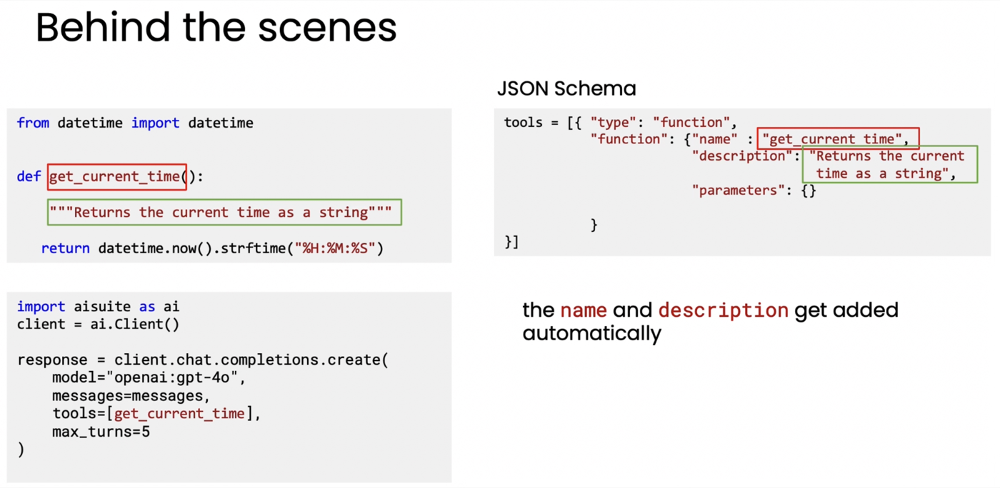
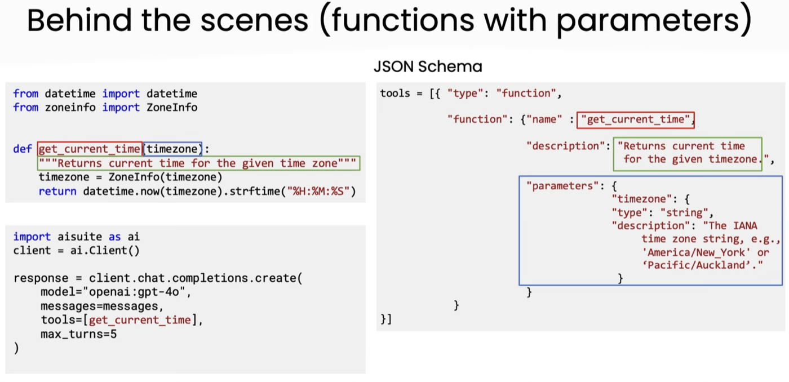

# 03. 도구 문법 (Tool syntax)

> Module 3 · Lesson 3
> 이전 → [02. 도구 만들기](02-creating-a-tool.md) · 다음 → [04. Ungraded Lab: 함수를 도구로](04-lab-functions-into-tools.md)

> ⚠ 원본 노션 노트의 이 절에는 앞 레슨(02)의 요약이 그대로 복사돼 있습니다.
> 아래는 **슬라이드 두 장에서 직접 읽어낸 내용**입니다.

## 한 줄 요약

**파이썬 함수를 그대로 넘기면 JSON Schema가 자동으로 만들어집니다.**
이름과 설명은 **함수명과 docstring에서** 나옵니다.

---

## 1. 현대 방식 — 함수를 그냥 넘긴다

```python
from datetime import datetime

def get_current_time():
    """Returns the current time as a string"""
    return datetime.now().strftime("%H:%M:%S")


import aisuite as ai
client = ai.Client()

response = client.chat.completions.create(
    model="openai:gpt-4o",
    messages=messages,
    tools=[get_current_time],    # ← 함수 객체를 그대로
    max_turns=5,
)
```



`FUNCTION:` 프롬프트도, 정규식 파싱도 없습니다. **함수를 리스트에 넣기만 합니다.**

## 2. 뒤에서 일어나는 일 — JSON Schema

`tools=[get_current_time]`은 내부적으로 이렇게 변환됩니다.

```json
tools = [{
  "type": "function",
  "function": {
    "name": "get_current_time",
    "description": "Returns the current time as a string",
    "parameters": {}
  }
}]
```

| Schema 필드 | 출처 |
|---|---|
| `name` | **함수 이름** |
| `description` | **docstring** |
| `parameters` | 함수 시그니처 (인자가 없으면 `{}`) |

> **name과 description은 자동으로 채워집니다.**
> 그래서 **docstring이 곧 인터페이스**입니다 — 모델이 "이 도구를 언제 쓸까"를 판단하는
> 근거가 그 문장입니다.

## 3. 인자가 있는 함수

```python
from datetime import datetime
from zoneinfo import ZoneInfo

def get_current_time(timezone):
    """Returns current time for the given time zone"""
    timezone = ZoneInfo(timezone)
    return datetime.now(timezone).strftime("%H:%M:%S")
```



`parameters`가 채워집니다.

```json
"parameters": {
  "timezone": {
    "type": "string",
    "description": "The IANA time zone string, e.g., 'America/New_York' or 'Pacific/Auckland'."
  }
}
```

**인자 설명까지 docstring에서 옵니다.** 그래서 파라미터 설명을 부실하게 쓰면
모델이 `timezone="한국"` 같은 값을 넣습니다 — IANA 문자열이라는 것도, 예시도 모르니까요.

> 💡 `requirements.txt`의 **`docstring-parser`** 가 이 일을 합니다.
> 이 강의에서 확정적으로 쓰이는 몇 안 되는 패키지 중 하나입니다.

## 4. `max_turns` — 반복의 상한

```python
max_turns=5
```

[02번](02-creating-a-tool.md)의 ⑤단계(최종 응답 or 다음 도구 호출 → 반복)에 **상한**을
두는 값입니다. 도구를 부르고 결과를 받고 또 부르는 루프가 무한히 돌지 않게 합니다.

---

## 정리 — 세 시대

| | 도구 선언 | 호출 신호 | 파싱 |
|---|---|---|---|
| 예전 | 시스템 프롬프트에 텍스트로 | `FUNCTION: name()` | 개발자 정규식 |
| 현대 (raw API) | JSON Schema 를 손으로 작성 | 구조화된 `tool_calls` | SDK |
| **현대 (aisuite)** | **함수 객체를 그대로** | 구조화된 `tool_calls` | **자동** |

가운데 단계가 생략되는 것이 이 레슨의 요점입니다. 다만 **JSON Schema가 자동 생성된다는 것을
알아야** 왜 docstring이 중요한지 이해할 수 있습니다.

---

**다음 →** [04. Ungraded Lab: 함수를 도구로 만들기](04-lab-functions-into-tools.md)
