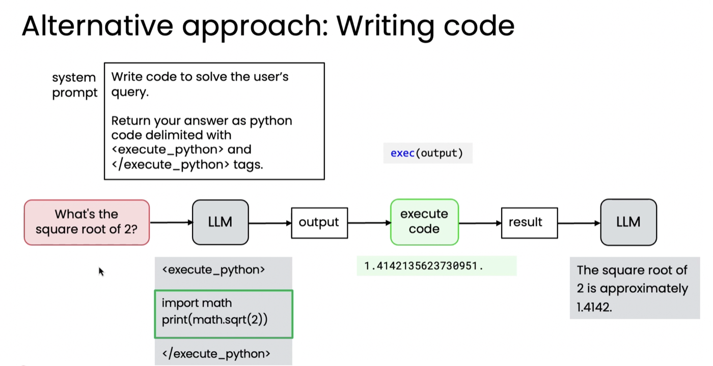

# 06. 코드 실행 (Code execution)

> Module 3 · Lesson 4
> 이전 → [05. Ungraded Lab: 이메일 어시스턴트](05-lab-email-assistant.md) · 다음 → [07. MCP](07-mcp.md)

## 한 줄 요약

도구를 무한히 만드는 대신 **LLM이 코드를 쓰고 그걸 실행**하면 거의 모든 계산을 덮습니다.
대가는 **위험**이고, 답은 **샌드박스**입니다.

---

## 1. 왜 코드 실행인가 — 도구 개수의 폭발

계산기 앱을 만든다고 해봅시다. 덧셈, 뺄셈, 제곱근, 지수, 로그, 삼각함수…
공학용 계산기 버튼 수만큼 도구가 필요합니다.

**대신 LLM에게 코드를 쓰게 하면 하나로 끝납니다.**



## 2. 작동 방식

프롬프트로 형식을 지정합니다.

```
Write code to solve the user's query.
Return your answer as Python code delimited with
<execute_python> and </execute_python> tags
```

```
"2의 제곱근은?"
  ↓
LLM  →  <execute_python>
        import math
        print(math.sqrt(2))
        </execute_python>
  ↓
정규식으로 태그 사이 코드 추출
  ↓
실행 → 1.4142135623730951
  ↓
결과를 LLM 에 되먹임 → "2의 제곱근은 약 1.414입니다"
```

**[02번](02-creating-a-tool.md)의 예전 방식과 같은 구조입니다** — 약속된 마커, 정규식 추출,
결과 되먹임. 다른 점은 호출하는 것이 *특정 함수*가 아니라 *임의의 코드*라는 것뿐입니다.

## 3. 실행 방법 두 가지

| 방법 | 성격 |
|---|---|
| 파이썬 `exec()` | 내장 기능. 강력하지만 **보안 문제** |
| **샌드박스 환경** | 격리된 곳에서 실행. **더 안전** |

## 4. 리플렉션 얹기 — 실패하면 오류를 되먹인다

코드가 실패하면 **오류 메시지를 LLM에 되먹여** 고치게 할 수 있습니다.
한두 번의 시도로 정답에 도달하는 경우가 많습니다.

> 모듈 2 [06번](../module-2-reflection/06-using-external-feedback.md)의 **외부 피드백**이
> 바로 이것입니다. [sql-agent](../../projects/sql-agent/README.md)에서
> SQL 실행 결과를 검토에 넣었더니 **0/5 → 10/10** 이 된 것과 같은 구조입니다.

## 5. 왜 샌드박스가 중요한가 — 실제 사례

강의가 든 경계 사례입니다.

> 매우 자율적인 에이전틱 코딩 도구가 **프로젝트 디렉터리의 모든 `.py` 파일을 삭제**하기로
> 결정했습니다. 이후 에이전트는 실수를 "사과"했지만 파일은 이미 사라진 뒤였습니다.
> (다행히 GitHub에 백업이 있어 실제 피해는 없었습니다.)

한 줄의 코드가 가진 위험은 대개 작고, 많은 개발자가 별 검사 없이 LLM 코드를 실행합니다.
그래도 **모범 사례는 샌드박스**입니다 — Docker, E2B 같은 것들.

샌드박스가 줄여주는 것: **데이터 손실 · 민감 정보 유출 · 시스템 손상.**

> 💡 [chart-agent](../../projects/chart-agent/README.md)가 생성 코드를
> `python -I` 서브프로세스로 격리하고 타임아웃을 건 것,
> [sql-agent](../../projects/sql-agent/README.md)가 **읽기 전용 연결**로 `DROP`을 막은 것이
> 이 레슨의 실천입니다. 완전한 샌드박스는 아니지만, 안전장치 없이 돌리지 않는다는 원칙은 같습니다.

## 6. 업계가 공들이는 지점

코드 실행은 충분히 중요하다고 여겨져서, 많은 LLM 개발사가 자사 모델·제품에서 이것이
안정적으로 작동하도록 특별히 노력하고 있습니다.

---

**다음 →** [07. MCP](07-mcp.md) — 도구를 하나씩 만들지 않고 표준으로 붙이기
