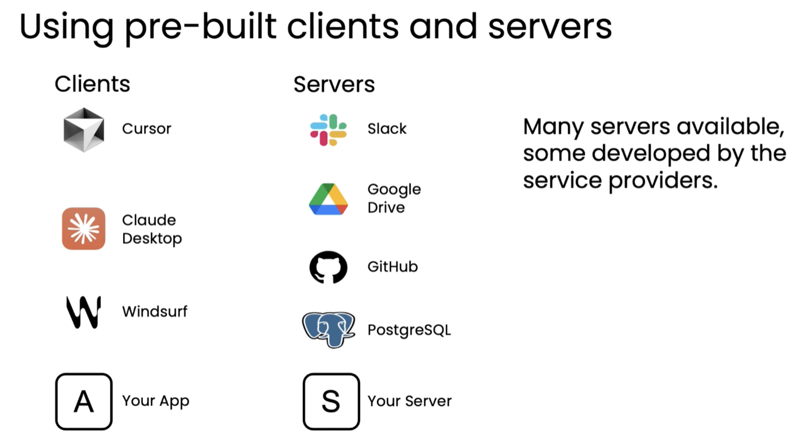

# 07. MCP (Model Context Protocol)

> Module 3 · Lesson 5 (모듈 마지막)
> 이전 → [06. 코드 실행](06-code-execution.md)

## 한 줄 요약

도구 연동의 총작업량을 **M × N에서 M + N으로** 줄이는 표준입니다.

---

## 1. MCP란

Anthropic이 제안한 표준으로, 지금은 여러 기업과 개발자들이 널리 채택하고 있습니다.

**목적:** LLM이 더 많은 **컨텍스트(데이터)** 와 더 많은 **도구**에 **표준화된 방식으로**
접근하게 하는 것.

## 2. 해결하는 문제 — M × N

MCP 이전에는 애플리케이션을 Slack, Google Drive, GitHub, Postgres와 연동하려면
**각각에 대해 커스텀 래퍼 코드를 직접** 써야 했습니다.

문제는 **서로 다른 팀이 같은 도구의 래퍼를 각자 만든다**는 것입니다.

```
애플리케이션 M 개  ×  도구/데이터 소스 N 개  =  커뮤니티 전체 작업량 M × N
```

MCP는 접근 방식을 표준화해서 이것을 **M + N**에 가깝게 줄입니다.

| | 이전 | MCP |
|---|---|---|
| 앱 10개 × 도구 20개 | 래퍼 **200개** | **30개** (앱 10 + 서버 20) |

## 3. 핵심 개념

| 용어 | 뜻 |
|---|---|
| **MCP 클라이언트** | 도구·데이터에 접근하려는 **애플리케이션** |
| **MCP 서버** | 특정 데이터 소스·서비스에 대한 접근을 제공하는 **래퍼** |
| **리소스(resources)** | MCP 문서에서 **데이터 페칭** 도구를 부르는 이름 |

초기 MCP 설계는 컨텍스트·데이터 접근에 크게 초점을 맞췄고, 그래서 데이터를 가져오는
도구들을 "리소스"라 부릅니다. 다만 MCP는 **데이터 페칭뿐 아니라 일반적인 함수/액션**도
지원합니다.

클라이언트와 서버 양쪽 모두 생태계가 빠르게 크고 있습니다. 개발자는 **자기 클라이언트**를
만들 수도, **자기 서버**를 만들어 리소스를 남에게 제공할 수도 있습니다.



강의가 든 실제 목록입니다.

| 클라이언트 | 서버 |
|---|---|
| Cursor · Claude Desktop · Windsurf | Slack · Google Drive · GitHub · PostgreSQL |
| **Your App** | **Your Server** |

> *"서버가 많이 나와 있고, 일부는 **서비스 제공자가 직접** 만든다."*
> Slack 서버를 Slack이 만들면, 붙이는 쪽은 아무것도 안 만들어도 됩니다.

## 4. 실시간 예시 — Claude Desktop + GitHub MCP 서버

**질의 1** — *"[GitHub 저장소 URL]의 README.md를 요약해줘"* (AISuite 저장소)

```
MCP 클라이언트 → GitHub MCP 서버에 README 요청
              → 파일 내용이 LLM 컨텍스트로
              → 요약 생성
```

**질의 2** — *"최근 풀 리퀘스트는?"*

같은 서버의 **다른 도구 호출**(PR 목록 조회)이 트리거되고, 결과가 LLM에 들어가 요약됩니다.

> **서버 하나가 도구 여러 개를 제공한다**는 점이 요점입니다. GitHub 서버를 붙이면
> README 읽기, PR 조회, 이슈 조회… 가 한꺼번에 따라옵니다.

## 5. 더 배우려면

DeepLearning.AI에 **MCP 프로토콜 전용 심화 단기 강좌**가 따로 있습니다.

> ⚠ 이 저장소의 `requirements.txt`에는 **`mcp` 패키지가 없습니다.**
> 이 레슨이 개념 위주이거나, 랩 노트북 안에서 별도 설치할 가능성이 있습니다
> ([루트 README](../../README.md)의 "눈에 띄는 공백" 참고).

---

## 모듈 3 마무리

LLM에게 도구 접근 권한을 주는 것이 **더 강력한 에이전틱 애플리케이션의 핵심**입니다.

## 다음 모듈 예고 — 평가와 오류 분석

강사의 말이 강합니다.

> 에이전틱 워크플로우를 **효과적으로 만드는 팀과 그렇지 못한 팀을 가르는 가장 큰 차이**는
> **체계적인(disciplined) 평가 프로세스**를 운영할 수 있는 능력이다.
>
> 이 모듈이 **전체 강좌에서 어쩌면 가장 중요한** 모듈일 수 있다.

> 💡 [sql-agent](../../projects/sql-agent/README.md)에서 판정기를 만들고 조건별 성공률을
> 낸 것이 이 모듈의 선행 연습이었습니다. *"0/3"* 이 실은 JSON 형식 문제였다는 것도
> **오류 분석**의 사례입니다.
