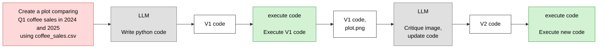
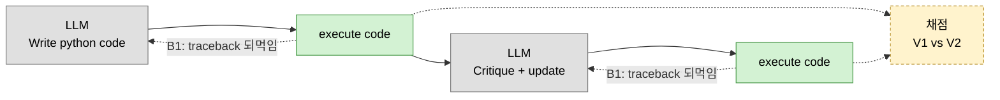

# Chart Agent

DeepLearning.AI *Agentic AI* 모듈 2 ungraded 랩 "Chart Generation" 자체 구현.
**멀티모달 LLM이 생성된 차트를 직접 보고** 비평한 뒤 코드를 고쳐 다시 그린다.

- 기획 의도와 범위: [PLAN.md](PLAN.md)
- 작업 현황: [CHECKLIST.md](CHECKLIST.md)
- 강의 개념 정리: [모듈 2 학습 노트](../../notes/module-2-reflection/README.md)

> **구현 상태: 설계 단계.** 아직 코드가 없습니다.
> 아래 실행 결과 항목은 구현 후 실측값으로 채웁니다.

---

## 워크플로우 — 강의 슬라이드와 1:1

[03번 노트](../../notes/module-2-reflection/03-chart-generation-workflow.md)의
"Chart generation agentic workflow" 슬라이드를 그대로 옮긴 것입니다.

박스 색은 [강의 표기 규칙](../../notes/module-1-agentic-workflows/02-degrees-of-autonomy.md)을 따릅니다 —
🔴 사용자 입력 · ⬜ LLM 호출 · 🟩 코드 실행 · 흰색 = **산출물(단계가 아님)**.



### 이 그림에서 읽어야 할 두 가지

**1. 초록 박스가 두 번 나온다.** 코드 실행이 두 번이고, 둘 다 도구 호출입니다.

**2. 두 번째 LLM 박스는 하나다.** *"Critique image, update code"* — **비평과 코드 수정이 한 호출**입니다.
랩 코드도 같습니다:

```python
def reflect_on_image_and_regenerate(...) -> tuple[str, str]:
    # 반환: (feedback, refined_code_with_tags)
```

응답 첫 줄이 `{"feedback": "..."}` JSON이고, 그 다음 줄부터 `<execute_python>` 블록입니다.
**이 파싱이 랩의 학습 포인트**이므로 기본 구현은 합친 형태를 유지합니다.
분리는 플래그로만 제공합니다 ([PLAN §3 B4](PLAN.md)).

**3. `A2` 상자에 주목.** 두 번째 LLM에 들어가는 건 `plot.png`만이 아니라
**`V1 code, plot.png` 둘 다**입니다. 이미지만 보면 "왜 이렇게 그려졌는지"를 모릅니다.

### 실행 시점은 모델이 정하지 않습니다

랩이 직접 밝힌 설계 의도입니다.

> *"The chart execution steps are intentionally **hard-coded** to run right after code
> generation/refinement. This mirrors the workflow in the lecture and ensures you see
> each draft's output before moving on."*

[자율성 스펙트럼](../../notes/module-1-agentic-workflows/02-degrees-of-autonomy.md)에서
모듈 1 리서치 에이전트보다도 **낮은 위치**입니다 — 거기서는 최소한 도구 선택이 모델 몫이었습니다.

덜 발전된 설계가 아닙니다. **반성 패턴만 격리해 관찰하려는 의도적 선택**이고,
학습자가 매 초안의 출력을 반드시 보게 만드는 장치이기도 합니다.
이 프로젝트도 실행 시점을 모델에게 넘기지 않습니다.

---

## 랩과 달라지는 점 3가지

셋 다 **확장(B)이며, 랩 재현(A)이 끝난 뒤에 붙입니다.**
위 다이어그램에는 일부러 넣지 않았습니다 — 슬라이드에 없는 것이기 때문입니다.



### B1. 실행 오류 되먹임

랩의 실행부입니다.

```python
match = re.search(r"<execute_python>([\s\S]*?)</execute_python>", code_v1)
if match:
    exec(initial_code, {"df": df})    # 예외 → 노트북 중단, stderr 접근 불가
```

| | 랩 | 이 프로젝트 |
|---|---|---|
| 예외 | 프로세스 중단 | 잡아서 **traceback을 재생성 프롬프트에 주입** |
| 태그 없음 | `if match:` — **else가 없어 조용히 통과** | 명시적 실패 |
| stderr | 접근 불가 | 캡처해서 되먹임 재료로 사용 |

증상이 랩 프롬프트에 남아 있습니다. `date` 컬럼 타입 오류를 막으려고
**"CRITICAL", "NEVER do", "ALWAYS"로 같은 경고를 세 번 반복**합니다.
실행 오류를 되먹이는 구조라면 프롬프트로 방어할 필요가 없습니다 —
[06번 노트의 빨간 곡선](../../notes/module-2-reflection/06-using-external-feedback.md)입니다.

⚠ subprocess는 **진짜 샌드박스가 아닙니다.** 타임아웃과 작업 디렉터리 격리만 제공하며
로컬 학습 용도로 한정합니다.

### B2·B3. 채점

랩은 V1·V2를 만들 뿐 점수를 매기지 않습니다.
[05번 노트](../../notes/module-2-reflection/05-evaluating-reflection.md)의 "재보고 결정하라"가 빠져 있습니다.

강의는 "제목이 있는가"를 **LLM에게 묻지만**, 차트를 우리가 실행하므로
**Figure 객체에 직접 물어볼 수 있습니다.** `plt.savefig`를 감싸 저장 직전 상태를 덤프합니다.

| 체크 | 판정 | 출처 |
|---|---|---|
| 실행 성공 | 종료 코드 0 | — |
| 제목 존재 | `ax.get_title() != ""` | 랩 프롬프트 요구사항 3 |
| x/y축 레이블 | `get_xlabel()` / `get_ylabel()` | 랩 프롬프트 요구사항 3 |
| 범례 존재 | `ax.get_legend() is not None` | 랩 프롬프트 요구사항 3 |
| dpi=300 저장 | `savefig` 인자 캡처 | 랩 프롬프트 요구사항 4 |
| 계열이 시각적으로 구분되는가 | 아래 참고 | V1의 결함 |

앞 5개는 **랩 프롬프트가 명시한 요구사항을 코드로 되받아 확인**하는 것입니다.

LLM으로만 가능한 것(차트 유형 적절성, 색상 구분)은 루브릭으로 넘깁니다 —
**이진 기준 합산, 단일 이미지 채점, 채점 모델 분리** ([05번 노트](../../notes/module-2-reflection/05-evaluating-reflection.md) 규칙).

---

## V1의 결함은 실행마다 다르다

⚠ 확보한 두 자료의 V1이 **서로 다릅니다.**

| 출처 | V1 차트 | 결함 |
|---|---|---|
| 강의 슬라이드 (`plot.png`) | x축 = 연도, 음료 8종을 **누적(stacked)** | 연도 총합만 보이고 **음료별 비교 불가** |
| 랩 노트북 실행 출력 | x축 = 음료명, 같은 위치에 두 해를 겹쳐 그림 (`alpha=0.6`) | 짧은 막대가 **가려짐** |

```python
# 랩 노트북이 실제로 생성한 V1
plt.bar(comparison['coffee_name'], comparison['price_2024'], label='2024', alpha=0.6)
plt.bar(comparison['coffee_name'], comparison['price_2025'], label='2025', alpha=0.6)
# 오프셋 없이 같은 x 위치에 두 번
```

**같은 프롬프트인데 결함의 종류가 다릅니다.** LLM 출력이 비결정적이기 때문입니다.

그래서 채점은 **특정 결함을 하드코딩하지 않습니다.**
`"막대가 겹치는가"`가 아니라 `"두 계열이 시각적으로 구분되는가"`로 판정합니다 —
누적이든 겹침이든 똑같이 걸립니다.

공통점은 하나입니다. **둘 다 문법적으로 멀쩡하고, 그림을 봐야 결함이 보입니다.**
[03번 노트](../../notes/module-2-reflection/03-chart-generation-workflow.md)가 말한 지점입니다.

V2는 양쪽 다 **분리된 그룹 막대**로 수렴합니다.

---

## 데이터셋

원본 `coffee_sales.csv`는 랩과 함께 배포되며 확보하지 못했습니다.
랩 출력 표본에서 스키마를 읽어 **시드 고정 생성기로 재현**합니다.

```
date        2024-12-05    (datetime64)
time        09:18         (문자열 HH:MM — date와 문자열 결합 금지)
cash_type   card | cash
card        ANON-0000-0000-0141
price       1.812 (Espresso) · 2.596 (Cortado) · 3.282~3.576 (Latte)
coffee_name Latte / Americano / Cortado / Espresso · 슬라이드 기준 8종
quarter month year        파생 정수 컬럼 (already computed)
```

기간은 **2024-01-01 ~ 2025-03-31**. 지시문이 Q1 2024 vs Q1 2025 비교이므로
양쪽 분기가 온전해야 랩이 의도한 비교가 성립합니다.

> ⚠ **수량 컬럼이 없습니다. 1행 = 거래 1건입니다.**
>
> 근거는 프롬프트가 아니라 **`df.sample(n=5)`의 렌더링 결과**입니다 —
> 헤더 9개, 각 행 9셀, 생략 표시 없음. 실제 DataFrame이 출력된 것입니다.
> (프롬프트는 모델에게 *알려줄 것*을 고른 목록이라 스키마 전체라는 보장이 없습니다.)
>
> 보강 근거: `price`가 잔당 단가(2.596/3.576/1.812)인데 V1 코드는
> `groupby(...)['price'].sum()` 에 y축 "Total Sales ($)"를 붙입니다 —
> **수량이 항상 1일 때만 성립**합니다.
>
> 따라서 판매 차이는 **행 수로** 만듭니다.

> **스키마를 프롬프트에 주입하는 것이 랩의 핵심 기법입니다.**
> 모델은 CSV를 볼 수 없습니다. 컬럼명·타입·이미 계산된 파생 컬럼을 알려주지 않으면
> 없는 컬럼을 쓰거나 직접 파싱을 시도합니다.

---

## 이미지 입력은 왜 aisuite를 안 쓰는가

모듈 1에서는 aisuite로 모델을 문자열 하나로 갈아끼웠습니다. 이미지는 다릅니다.

| provider | aisuite가 하는 일 |
|---|---|
| OpenAI | dict를 **그대로 통과** → OpenAI 형식 이미지 블록 동작 |
| Anthropic | `content`를 **그대로 통과**. OpenAI 형식(`image_url`)을 Anthropic 형식(`source.base64`)으로 **변환하지 않음** |

즉 **aisuite는 이미지에 관해 아무 일도 하지 않습니다.**
랩이 `image_openai_call`과 `image_anthropic_call`을 따로 둔 이유가 이것입니다.

```
텍스트 호출  →  aisuite            (모델 교체 자유)
이미지 호출  →  provider 직접 라우팅 (형식이 다름)
```

---

## 사용법 (예정)

```bash
source venv/bin/activate
cd projects/chart-agent

# 전체 — 랩 4장 run_workflow 대응
python run.py "Create a plot comparing Q1 coffee sales in 2024 and 2025"

# 단계 단독 — 랩 3.1~3.4 개별 실습 대응
python run.py "..." --only v1                     # V1 생성·실행까지
python run.py "..." --from-chart charts/x_v1.png  # 비평부터
```

| 옵션 | 동작 |
|---|---|
| `--gen-model` | V1 생성 모델 (기본 `openai:gpt-4.1-mini`) |
| `--reflect-model` | 비평·수정 모델 (기본 `openai:gpt-5`) |
| `--basename` | 저장 파일명 접두사. **실행마다 바꿔야 덮어쓰지 않음** |
| `--only` / `--from-chart` | 단계 단독 실행 |
| `-v` | 생성된 코드와 실행 로그 출력 |
| `--no-eval` | 채점 생략 (B2·B3) |

검토 모델 기본값은 **랩과 같이 OpenAI**입니다. 랩에서 Claude는 주석 처리된 대안이었고,
기본을 Anthropic으로 두면 키가 없는 환경에서 바로 실패합니다.

```bash
python run.py "..." --reflect-model anthropic:claude-sonnet-5   # provider 라우팅 검증
```

**모델 조합을 바꿔보는 것이 랩이 권장한 실험입니다.**
생성은 빠른 모델, 검토는 추론 모델 — [01번 노트 §3](../../notes/module-2-reflection/01-reflection-basics.md)의 구성입니다.

### 매 단계 산출물이 보입니다

랩은 각 단계의 중간 결과를 학습자에게 보여줍니다 (`print_html`).
노트북 HTML 렌더링은 버리되 **표시 자체는 남깁니다** — 콘솔 출력 + 파일 저장.

```
추출된 코드 → V1 차트 경로 → 비평 원문 → V2 코드 → V2 차트 경로
```

*"you'll see both the reflection written by the LLM and the new code it generated"*
— 랩 마크다운 원문입니다. 이 표시가 없으면 랩의 목적이 깨집니다.

---

## 실행 결과

> 구현 후 채웁니다.

- [ ] V1 / V2 차트 이미지
- [ ] 비평 텍스트 원문
- [ ] 비평이 V1의 결함(누적 또는 겹침)을 지적했는지
- [ ] 객관 체크 결과 (V1 vs V2)
- [ ] 모델 조합을 바꿨을 때의 차이
- [ ] B1 오류 되먹임 발동 횟수
