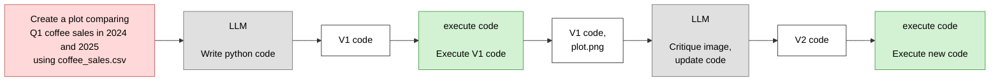
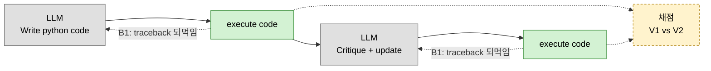

# Chart Agent

DeepLearning.AI *Agentic AI* 모듈 2 ungraded 랩 "Chart Generation" 자체 구현.
**멀티모달 LLM이 생성된 차트를 직접 보고** 비평한 뒤 코드를 고쳐 다시 그린다.

| | |
|---|---|
| 기획 의도와 범위 | [PLAN.md](PLAN.md) |
| 작업 현황 | [CHECKLIST.md](CHECKLIST.md) |
| 랩 대조 기록 | [회고](../../notes/retrospectives/chart-agent-lab-findings.md) |
| 강의 개념 | [모듈 2 학습 노트](../../notes/module-2-reflection/README.md) |

> **구현 상태: 3/7단계 완료.** 데이터·실행·LLM 계층까지. 다음은 4단계 워크플로우.

---

## 워크플로우 — 강의 슬라이드와 1:1

[03번 노트](../../notes/module-2-reflection/03-chart-generation-workflow.md)의
"Chart generation agentic workflow" 슬라이드를 그대로 옮긴 것입니다.

박스 색은 [강의 표기 규칙](../../notes/module-1-agentic-workflows/02-degrees-of-autonomy.md)을 따릅니다 —
🔴 사용자 입력 · ⬜ LLM 호출 · 🟩 코드 실행 · 흰색 = **산출물(단계가 아님)**.



### 이 그림에서 읽어야 할 것

**1. 초록 박스가 두 번.** 코드 실행이 두 번이고 둘 다 도구 호출입니다.

**2. 두 번째 LLM 박스는 하나.** *"Critique image, update code"* — **비평과 수정이 한 호출**입니다.
응답 첫 줄이 `{"feedback": "..."}` JSON, 그 다음이 `<execute_python>` 블록입니다.
이 파싱이 랩의 학습 포인트라 기본 구현은 합친 형태를 유지합니다.

**3. `A2` 상자.** 두 번째 LLM에 들어가는 건 `plot.png`만이 아니라 **V1 코드도 함께**입니다.
이미지만 보면 왜 그렇게 그려졌는지 모릅니다.

**4. 실행 시점은 모델이 정하지 않습니다.** 랩이 밝힌 의도 —
*"intentionally hard-coded … ensures you see each draft's output before moving on."*
반성 패턴만 격리해 관찰하려는 선택이므로 그대로 따릅니다.

---

## 랩에 없는 것을 왜 더하는가

**모듈 2가 가르친 것 중 랩이 실습하지 않는 부분이 있습니다.**

| 레슨 | 가르친 것 | 랩 | 우리 |
|---|---|---|---|
| [01](../../notes/module-2-reflection/01-reflection-basics.md) | *"외부 정보를 넣을 기회를 찾을 것"* — 실행 결과를 되먹여라 | ❌ | B1 |
| [02](../../notes/module-2-reflection/02-why-not-direct-generation.md) | 직접 생성 vs 반성 | ✅ | — |
| [03](../../notes/module-2-reflection/03-chart-generation-workflow.md) | 멀티모달 비평 | ✅ **랩의 본체** | A |
| [05](../../notes/module-2-reflection/05-evaluating-reflection.md) | *"반성은 공짜가 아니다. 재보고 결정하라"* | ❌ | B2·B3 |
| [06](../../notes/module-2-reflection/06-using-external-feedback.md) | 정체기 돌파 = 외부 피드백 | ❌ | B1 |

랩만 그대로 따라하면 **03번 레슨만 실습하는 셈**입니다.

특히 아이러니한 지점 — 랩 프롬프트는 `date` 타입 오류를 막으려고
**"CRITICAL", "NEVER do", "ALWAYS"로 같은 경고를 세 번 반복**합니다.
01번이 가르친 대로 실행 오류를 되먹였다면 그 경고가 애초에 필요 없습니다.

그리고 B2·B3는 순수한 추가가 아닙니다. 랩 README가 설명하는 **원본 버전에는 있었고**
(*"Compare: side-by-side comparison"*, *"logs_*.txt"*) 배포본에서 빠졌습니다.

### 그래도 A를 먼저 끝냅니다

B가 정당하다고 해서 먼저 하면 안 됩니다.

| | 판단 기준 |
|---|---|
| **A** | 랩이 만들라고 한 것 — 재현했는지가 명확 |
| **B** | 강의가 가르쳤는데 랩이 안 한 것 — **내 판단이 들어간다** |

섞으면 "랩을 구현한 것"인지 "내 아이디어를 구현한 것"인지 구분이 사라집니다.
초안에서 실제로 그랬고, 그래서 [규칙 2번](CHECKLIST.md)을 넣었습니다.
아래 셋을 위 다이어그램에 넣지 않은 이유도 같습니다.



### B1. 실행 오류 되먹임

랩은 `exec`가 예외를 내면 노트북이 멈추고 stderr에 접근할 수 없습니다.
subprocess로 옮겨 **stderr를 잡고 재생성 프롬프트에 주입**합니다 —
[06번 노트](../../notes/module-2-reflection/06-using-external-feedback.md)의 외부 피드백입니다.

⚠ subprocess는 **샌드박스가 아닙니다.** 타임아웃·작업 디렉터리 격리·`-I`만 제공하며
syscall 필터링은 없습니다. 로컬 학습 용도로 한정합니다.

### B2·B3. 채점

랩은 V1·V2를 만들 뿐 점수를 매기지 않습니다.
강의는 "제목이 있는가"를 **LLM에게 묻지만**, 차트를 우리가 실행하므로
**Figure 객체에 직접 물어볼 수 있습니다.**

| 체크 | 판정 |
|---|---|
| 실행 성공 | 종료 코드 0 + 파일 존재 |
| 제목 / x·y축 레이블 / 범례 | `ax.get_title()` 등 |
| dpi=300 | `savefig` 인자 캡처 |
| **지시문 충족** | 지시문이 요구한 비교 차원이 차트에 남아 있는가 |
| 계열 구분 | 누적·겹침 검출 (퇴행 검출용) |

앞 4개는 **랩 프롬프트가 명시한 요구사항을 코드로 되받아 확인**하는 것입니다.

> ⚠ **"지시문 충족"이 가장 중요합니다.** 랩의 실물 V2는 연도 비교를 잃고도
> 제목·축·범례·dpi를 다 갖춰 나머지 항목에서 만점을 받습니다.
> **반성이 차트를 퇴행시킨 실물 사례** — [회고 §1](../../notes/retrospectives/chart-agent-lab-findings.md)

LLM으로만 가능한 것(차트 유형 적절성, 색상 구분)은 루브릭으로 —
**이진 기준 합산, 단일 이미지, 채점 모델 분리** ([05번 노트](../../notes/module-2-reflection/05-evaluating-reflection.md) 규칙).

---

## 데이터셋

랩의 [`coffee_sales.csv`](../../labs/module-2/coffee_sales.csv)를 씁니다.
없으면 [자체 생성기](chart_agent/dataset.py) 산출물로 폴백합니다.

```
date        2024-03-01    (datetime64[us])
time        06:14         (문자열 HH:MM — date와 결합 금지)
cash_type   card | cash
card        ANON-0000-0000-0001
price       음료·시기별 6단계
coffee_name 8종 — Americano / Americano with Milk / Cappuccino / Cocoa /
            Cortado / Espresso / Hot Chocolate / Latte
quarter month year        로더가 파생 (already computed)
```

3,636행 · 2024-03-01 ~ 2025-03-23.

| 알아둘 것 | |
|---|---|
| **수량 컬럼 없음** | 1행 = 거래 1건. 판매량은 `price` 합계나 행 수 |
| **Q1 2024는 3월뿐** | 206행 vs Q1 2025 943행. 결과 해석 시 유의 |

> **스키마를 프롬프트에 주입하는 것이 랩의 핵심 기법입니다.**
> 모델은 CSV를 볼 수 없습니다. 컬럼명·타입·파생 컬럼을 알려주지 않으면
> 없는 컬럼을 쓰거나 직접 파싱을 시도합니다.

---

## 이미지 입력은 왜 aisuite를 안 쓰는가

모듈 1에서는 aisuite로 모델을 문자열 하나로 갈아끼웠습니다. 이미지는 다릅니다.

| provider | aisuite가 하는 일 |
|---|---|
| OpenAI | dict를 **그대로 통과** → OpenAI 형식 블록 동작 |
| Anthropic | `content`를 **그대로 통과**. `image_url`을 `source.base64`로 **변환하지 않음** |

즉 **aisuite는 이미지에 관해 아무 일도 하지 않습니다.**
랩이 `image_openai_call`과 `image_anthropic_call`을 따로 둔 이유입니다.

```
텍스트 호출  →  aisuite            (모델 교체 자유)
이미지 호출  →  provider 직접 라우팅 (형식이 다름)
```

---

## 사용법 (예정)

```bash
source venv/bin/activate
cd projects/chart-agent

# 전체 — 랩 4장 run_workflow 대응
python run.py "Create a plot comparing Q1 coffee sales in 2024 and 2025"

# 단계 단독 — 랩 3.1~3.4 개별 실습 대응
python run.py "..." --only v1                     # V1 생성·실행까지
python run.py "..." --from-chart charts/x_v1.png  # 비평부터
```

| 옵션 | 동작 |
|---|---|
| `--gen-model` | V1 생성 모델 (기본 `openai:gpt-4.1-mini`) |
| `--reflect-model` | 비평·수정 모델 (기본 `openai:gpt-5`) |
| `--basename` | 저장 파일명 접두사. **실행마다 바꿔야 덮어쓰지 않음** |
| `--only` / `--from-chart` | 단계 단독 실행 |
| `-v` | 생성된 코드와 실행 로그 출력 |
| `--no-eval` | 채점 생략 (B2·B3) |

검토 모델 기본값은 **랩과 같이 OpenAI**입니다. 랩에서 Claude는 주석 처리된 대안이었습니다.

```bash
python run.py "..." --reflect-model anthropic:claude-sonnet-5   # provider 라우팅 검증
```

**모델 조합을 바꿔보는 것이 랩이 권장한 실험입니다.** 생성은 빠른 모델, 검토는 추론 모델 —
[01번 노트 §3](../../notes/module-2-reflection/01-reflection-basics.md)의 구성입니다.

### 매 단계 산출물이 보입니다

랩은 각 단계의 중간 결과를 학습자에게 보여줍니다 (`print_html`).
HTML 렌더링은 버리되 **표시는 남깁니다** — 콘솔 출력 + 파일 저장.

```
추출된 코드 → V1 차트 경로 → 비평 원문 → V2 코드 → V2 차트 경로
```

---

## 실행 결과

> 구현 후 채웁니다.

- [ ] V1 / V2 차트 이미지
- [ ] 비평 텍스트 원문
- [ ] 비평이 V1의 결함을 지적했는지
- [ ] 객관 체크 결과 (V1 vs V2)
- [ ] 모델 조합을 바꿨을 때의 차이
- [ ] B1 오류 되먹임 발동 횟수
