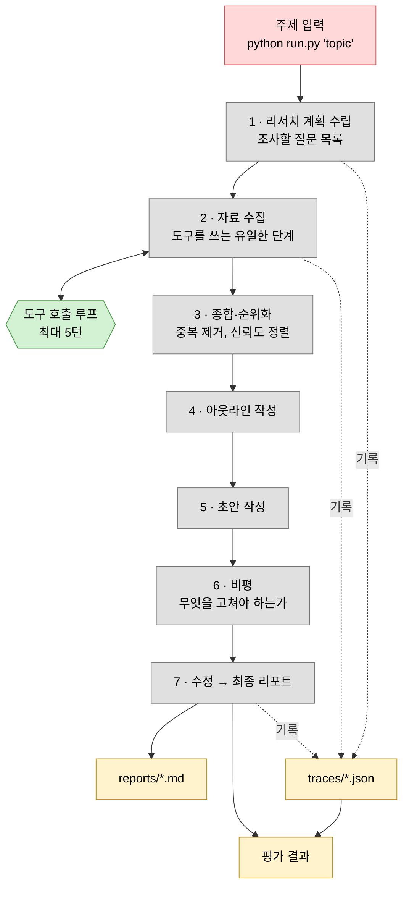
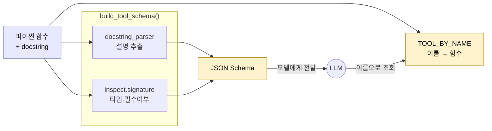
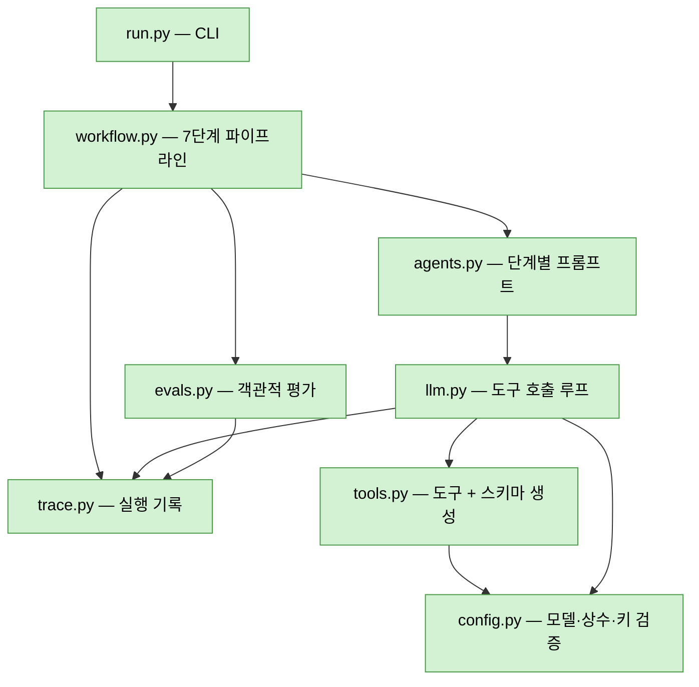
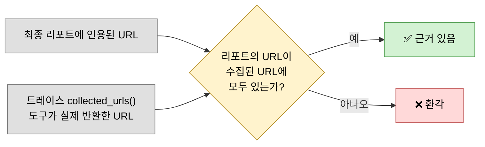

# Research Agent

DeepLearning.AI *Agentic AI* 모듈 1의 리서치 에이전트를 프레임워크 없이 직접 구현한 것.

- 기획 의도와 범위: [PLAN.md](PLAN.md)
- 작업 현황: [CHECKLIST.md](CHECKLIST.md)
- 강의 개념 정리: [모듈 1 학습 노트](../../notes/module-1-agentic-workflows/README.md)

> **구현 상태:** 완료. 전체 워크플로우 + 평가 8종, 자체 평가 통과.
> 공식 저장소 대조 회고까지 마쳤습니다 —
> [자체 구현 vs 공식 저장소](../../notes/retrospectives/research-agent-vs-official.md)

---

## 전체 실행 흐름

박스 색은 [강의의 표기 규칙](../../notes/module-1-agentic-workflows/02-degrees-of-autonomy.md)을 따릅니다 —
🔴 사용자 입력 · ⬜ LLM 호출 · 🟩 도구 호출.



5~7단계가 [작업 분해 노트](../../notes/module-1-agentic-workflows/05-task-decomposition.md)에서
"에세이 작성"을 세 개로 쪼갠 그 부분이며, 동시에 **반성(Reflection) 패턴**입니다.

### 자율성 경계

| 프로그래머가 정한 것 | 모델이 정하는 것 |
|---|---|
| 7단계의 **순서** | 도구를 **쓸지 말지** |
| 사용 가능한 **도구 목록** | **어떤** 도구를, **몇 번**, **무슨 검색어**로 |

강의 분류로 **반자율적(semi-autonomous)**. 단계 순서까지 모델이 정하는 형태는 모듈 5의 주제라 제외했습니다.

---

## 도구 호출 루프 (2단계 내부)

이 프로젝트의 학습 핵심. aisuite의 자동 실행(`max_turns`)에 위임하지 않고 직접 구현했습니다.

```mermaid
sequenceDiagram
    autonumber
    participant WF as workflow
    participant LOOP as run_tool_loop()
    participant LLM as OpenAI
    participant TOOL as tools.py

    WF->>LOOP: prompt (조사할 질문들)
    Note over LOOP: messages = [user prompt]

    loop 최대 MAX_TOOL_TURNS(5)턴
        LOOP->>LLM: messages + TOOL_SCHEMAS
        Note right of LLM: 도구 선택은 여기서<br/>모델이 판단
        LLM-->>LOOP: message.tool_calls

        alt tool_calls 없음
            LOOP-->>WF: 최종 답변 + 도구호출 기록
        else tool_calls 있음
            LOOP->>LOOP: assistant 메시지를 messages에 추가
            loop 요청된 각 호출
                LOOP->>TOOL: TOOL_BY_NAME[name](**args)
                TOOL-->>LOOP: [{title, url, snippet, source}]
                LOOP->>LOOP: role:"tool" + tool_call_id 로 되먹임
            end
        end
    end

    Note over LOOP: 상한 도달 시<br/>도구 없이 강제 답변
```

**`tool_call_id`가 핵심입니다.** 한 턴에 도구 3개를 요청하면 결과도 3개를 돌려줘야 하는데,
어느 결과가 어느 요청에 대한 것인지 이 id로만 짝지어집니다.

---

## 도구가 만들어지는 과정



**함수 정의 하나가 유일한 진실의 원천**입니다. 함수를 고치면 스키마가 자동으로 따라오므로
시그니처와 스키마가 어긋날 수 없습니다.

| 소스 | 스키마의 어디로 |
|---|---|
| 함수명 | `name` |
| docstring 요약 + 본문 | `description` |
| 타입 힌트 | `type` |
| `Args:` 항목별 설명 | 파라미터 `description` |
| 기본값 유무 | `required` 포함 여부 |

### 등록된 도구

| 도구 | 백엔드 | API 키 | docstring이 지시하는 역할 |
|---|---|---|---|
| `search_web` | Tavily | 필요* | 최신·상업·실용 정보 |
| `search_wikipedia` | wikipedia | 불필요 | 배경·정의·역사적 맥락 |
| `search_arxiv` | arXiv Atom API + PDF | 불필요 | 기술적 근거 (8개 분야 한정). **상위 3건은 초록이 아니라 본문 6페이지·5,000자** |

\* 키가 없으면 자동으로 목록에서 빠지고 나머지 두 개로 축소 동작합니다.

---

## 모듈 구조



| 파일 | 줄 | 역할 |
|---|---|---|
| `config.py` | 78 | 모델명, 상수, 경로, API 키 검증 |
| `tools.py` | 315 | docstring → JSON Schema 변환, 검색 도구 3종 |
| `llm.py` | 228 | aisuite 래퍼, **도구 호출 루프 직접 구현** |
| `trace.py` | 112 | 단계별 기록, `collected_urls()` |
| `agents.py` | 264 | 7개 단계별 프롬프트, `format_sources()` |
| `workflow.py` | 149 | 파이프라인 조립, 트레이스 연결 |
| `evals.py` | 265 | 객관적 평가 8종 |
| `run.py` | 96 | CLI |

---

## 평가 방식

채점 랩이 Pro 전용이라 자체 eval로 대체합니다.
[평가 노트](../../notes/module-1-agentic-workflows/06-evals.md)의 원칙 —
*"미리 예측하지 말고 만든 뒤 출력을 보고 eval을 만든다"* — 에 따라 아래는 출발점입니다.



**인용 정합성**이 대표 지표입니다. 코드로 셀 수 있고 참/거짓이 명확해,
강의가 예로 든 "경쟁사 언급 검출"과 같은 성격입니다.

### 전체 평가 항목

| 체크 | 판정 방법 | 기준 |
|---|---|---|
| **인용 정합성** | 리포트 URL ⊆ 트레이스 `collected_urls()` | 지어낸 URL 0건 |
| References 섹션 | 정규식 | 존재 |
| 도구 사용 | 호출 수, 실패 수 | 호출 > 0, 실패 0 |
| 소스 다양성 | 인용된 서로 다른 출처 수 | 3개 이상 |
| 분량 | 단어 수 | 400 이상 |
| 반성 효과 | `difflib` 초안↔최종 유사도 | 98% 미만 |
| 가독성 | `textstat` Flesch (References 제외) | 20 이상 |
| 링크 유효성 | GET + 브라우저 UA | **끊김(404/410) 0건** |

링크 평가는 **차단(403/429)과 끊김(404/410)을 구분**합니다.
페이월의 403은 인용이 틀렸다는 뜻이 아니라 검증이 불가능하다는 뜻이므로 실패로 세지 않습니다.
(첫 실행에서 `HEAD` 요청이 Wikipedia에서조차 403을 받아 멀쩡한 링크를 죽었다고 판정했습니다.)

LLM 판정자는 합격/불합격 판정에 쓰지 않습니다 — 강사가 1~5점 척도의 신뢰성 문제를
명시적으로 경고했기 때문입니다.

### 캐싱 (`--cache`)

같은 주제를 반복 실행하며 프롬프트를 다듬을 때 도구 결과를 재사용합니다.
기본은 **꺼짐** — 캐시된 실행은 새 조사가 아니므로, 최신 정보가 필요한 주제에
어제 검색 결과를 조용히 내놓는 일이 없어야 합니다. 켜면 히트마다 로그를 남깁니다.

⚠ **효과가 제한적입니다.** 캐시 키가 도구 인자 전체이고, 모델은 실행마다 검색어를
조금씩 다르게 씁니다(온도 0에서도). 실측에서 6회 호출 중 2회만 적중해 158.5s → 129.8s
(18% 단축)에 그쳤습니다. 상한은 자료 수집 단계가 차지하는 22%입니다.

---

## 사용법

```bash
# 저장소 루트의 .env 에 키 설정
#   OPENAI_API_KEY=sk-...
#   TAVILY_API_KEY=tvly-...   (선택, 없으면 Wikipedia+arXiv로 축소 동작)

source venv/bin/activate
cd projects/research-agent
python run.py "How do I build a new rocket company to compete with SpaceX?"
```

| 옵션 | 동작 |
|---|---|
| `--model` | aisuite 모델 id (기본 `openai:gpt-4.1-mini`) |
| `-v` | 도구 호출을 전부 로그로 출력 |
| `--cache` | 이전 실행의 도구 결과 재사용 (프롬프트 튜닝용) |
| `--no-eval` | 평가 생략 |
| `--no-link-check` | 링크 확인만 생략 (네트워크 요청 절약) |

종료 코드: `0` 전부 통과 · `2` 평가 실패 있음 · `1` 실행 오류.

### 실제 출력

```
[1/7] 리서치 계획 수립 ...
[2/7] 자료 수집 ...
[3/7] 종합·순위화 ...
[4/7] 아웃라인 작성 ...
[5/7] 초안 작성 ...
[6/7] 비평 (반성) ...
[7/7] 수정 → 최종 리포트 ...

리포트    reports/20260803-170727-how-do-i-build-a-new-rocket-company-to-c.md
트레이스  traces/20260803-170727-how-do-i-build-a-new-rocket-company-to-c.json

소요 시간  148.7s
도구 호출  6회
수집 소스  29개
리포트     1096 단어

=== 평가  8/8 통과 ===
  [PASS] 인용 정합성        21/21
  [PASS] References 섹션   있음
  [PASS] 도구 사용          6회
  [PASS] 소스 다양성        20개 도메인          기준 3개 이상
  [PASS] 분량              1096 단어           기준 400 이상
  [PASS] 반성 효과          초안 대비 81.4% 동일   98% 이상 동일하면 반성이 무의미
  [PASS] 가독성 (Flesch)    20.4               기준 20.0 이상
  [PASS] 링크 유효성        14/15 정상          차단 1 · 끊김 0 · 응답없음 0
```

출력물:

| 경로 | 내용 |
|---|---|
| `reports/<timestamp>-<slug>.md` | 인라인 인용 + References가 포함된 최종 리포트 |
| `traces/<timestamp>-<slug>.json` | 단계별 프롬프트·출력·도구 호출·소요 시간 |

---

## 평가 기반 개선 기록

첫 실행은 **6/8**이었습니다. 실패 2건의 원인을 나눠 판정한 뒤 각각 다르게 고쳤습니다.

| 실패 | 가설 | 검증 | 조치 |
|---|---|---|---|
| 링크 유효성 53% | 죽은 링크가 아니라 봇 차단 | ✅ 확인 — 15개 중 5개가 `HEAD` vs `GET`+UA에서 결과 상이 | **평가**를 수정 |
| 가독성 -9.7 | References의 URL이 점수 왜곡 | ⚠️ 부분만 — 제거해도 -3.5 | **평가 + 프롬프트** 둘 다 수정 |

가독성은 `agents.py`에 `PROSE_RULES`(25단어 이하 문장 등)를 추가해 **-3.5 → 20.4**로 올렸습니다.
분량과 인용 수는 오히려 늘었습니다 — 짧은 문장이 정보 밀도를 낮추지 않았습니다.

이 순서가 [평가 노트](../../notes/module-1-agentic-workflows/06-evals.md)가 말한
*"만든 뒤 출력을 보고 eval을 만든다"* 의 실제 사례입니다.

---

## 비용

1회 실행에 LLM 호출 7~12회 (`gpt-4.1-mini`), Tavily 크레딧 2~5.
Tavily 무료 티어가 월 1,000 크레딧이므로 월 200회 이상 실행 가능합니다.
