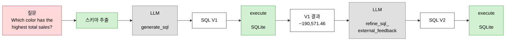

# SQL Agent

DeepLearning.AI *Agentic AI* 모듈 2 ungraded 랩
"Improving SQL Generation with Reflection" 자체 구현.

자연어 질문을 SQL로 바꾸고, **실행 결과를 보고** 검토한 뒤 쿼리를 고쳐 다시 실행합니다.

| | |
|---|---|
| 기획 의도와 범위 | [PLAN.md](PLAN.md) |
| 작업 현황 | [CHECKLIST.md](CHECKLIST.md) |
| 랩 원본 | [labs/module-2/sql/](../../labs/module-2/sql/) |
| 강의 개념 | [모듈 2 학습 노트](../../notes/module-2-reflection/README.md) |
| 해보고 알게 된 것 | [회고](../../notes/retrospectives/sql-agent.md) |

> **구현 상태: A단계(랩 재현) 완료.** 측정 결과는 맨 아래에 있습니다.
> 남은 것은 B단계 — 질문 6개짜리 정답 데이터셋입니다.
>
> ```bash
> cd projects/sql-agent
> python -m sql_agent.invariants           # 데이터가 랩과 같은지
> python -m sql_agent.sqlgen               # 프롬프트가 랩과 같은지
> python run.py --index 0 --all-conditions # 조건별 성공률
> ```
>
> 랩과 같은 것을 만들고 있는지 세 층에서 확인합니다.
>
> | 층 | 확인 |
> |---|---|
> | 데이터 | 10컬럼 × 5,000행이 랩 생성기 출력과 완전히 일치 |
> | 실행 | 랩 `execute_sql` 과 7개 케이스에서 출력 동일 |
> | 프롬프트 | 3개 모두 **앞 개행·뒤 들여쓰기까지** 랩과 일치 |

---

## 워크플로우



**`A2` → `LLM2` 화살표가 이 랩의 핵심입니다.** 검토 단계가 SQL 텍스트만이 아니라
**실행 결과를 함께 받는 것** — [06번 레슨](../../notes/module-2-reflection/06-using-external-feedback.md)이
말하는 외부 피드백이 여기에 해당합니다.

---

## 이 랩이 다루는 문제 — 문법으로 드러나지 않는 의미 오류

데이터가 **이벤트 로그**입니다. 한 행이 하나의 사건이고, 판매는 재고 유출이므로
`qty_delta`가 음수로 기록됩니다. 이벤트 소싱에서 정상적인 모델링입니다.

| `action` | `qty_delta` | 뜻 |
|---|---|---|
| `insert` · `restock` | **+** | 재고 유입 |
| `sale` | **−** | 재고 유출 |
| `price_update` | `0` | 가격만 변경 |

**문제는 그 의미가 스키마 타입에 드러나지 않는다는 것입니다.** 모델이 보는 건
`qty_delta (INTEGER)`뿐입니다. 그래서 이런 쿼리가 나옵니다.

```sql
SELECT color, SUM(qty_delta * unit_price) AS total_sales
FROM transactions WHERE action = 'sale' GROUP BY color
```

랩의 표현대로 *"technically valid but semantically incorrect"*입니다.

**실제로 돌려서 확인했습니다** — 생성기가 시드 42로 고정돼 있어 재현됩니다.

| 색 | 부호 무시 | 부호 반영 |
|---|---:|---:|
| white | −358,315.09 | **358,315.09** ← 1위 |
| black | −275,176.15 | 275,176.15 |
| red | −242,075.23 | 242,075.23 |
| green | −214,464.70 | 214,464.70 |
| blue | **−190,571.46** ← 1위 | 190,571.46 |

**순위가 완전히 뒤집힙니다.** 부호를 무시하면 "가장 덜 음수인" 색이 1위가 되므로,
정답에서 **꼴찌**인 blue가 1위로 나옵니다. 값이 조금 틀리는 게 아니라 답이 반대입니다.

**SQL 텍스트만 읽어서는 잡을 수 없습니다.** 스키마도 쿼리도 멀쩡합니다.
실행해서 음수를 봐야 보입니다 — 그것이 **외부 피드백**이 필요한 이유입니다.

> `−190,571.46`은 랩 문서의 값과 일치합니다.

---

## 스키마 — 모델이 보는 것은 이게 전부입니다

```
table name: transactions
id (INTEGER)           ← 사실상 유일한 순서 정보
product_id (INTEGER)
product_name (TEXT)
brand (TEXT)
category (TEXT)
color (TEXT)
action (TEXT)          ← 값이 4종이라는 정보는 없음
qty_delta (INTEGER)    ← 부호 규칙 없음
unit_price (REAL)      ← restock 에서 NULL 이라는 정보 없음
notes (TEXT)
ts (DATETIME)
```

**이것이 과제의 성격입니다.** 의미 규칙이 스키마에 없으므로 모델은 실행해봐야 압니다.
스키마를 보강하면 문제 자체가 사라집니다 — 하지 않습니다.

---

## 우리가 더하는 것

랩은 V1과 V2를 한 번씩 보여주고 끝납니다. 우리는 세 가지를 더합니다.

### 1. 값을 보고 판정합니다

랩은 결과를 보여주고 학습자가 눈으로 판단합니다. 우리는 **정답 판정기**를 만듭니다.

| # | 규칙 |
|---|---|
| 1 | 오류 DataFrame이 아닐 것 |
| 2 | 행이 1개 이상일 것 |
| 3 | **첫 행**의 그룹 키가 정답과 일치할 것 |
| 4 | 첫 행 값이 정답의 **±0.01** 이내일 것 |

SQL 문자열은 보지 않습니다 — `ABS(qty_delta)`와 `-qty_delta`는 같은 답을 냅니다.

### 2. 단발이 아니라 성공률로 봅니다

랩이 §3.4에서 명시합니다.

> *"Because LLMs are **stochastic**, every run may return slightly different results."*

단발 결과로는 실패했을 때 **우리 구현이 틀린 건지 모델이 흔들린 건지** 구분할 수
없습니다. 각 조건을 여러 번 돌려 성공률을 냅니다 — 넷 중 셋이 `temperature=0`이라
거의 결정적이므로 **반복은 실제로 흔들리는 조건에 몰아줍니다** (temp 0은 5회, 1.0은 10회).

### 3. 변인을 분리한 조건을 하나 더 둡니다

랩의 두 검토 함수는 실행 결과 말고도 `temperature`가 다릅니다(0 vs 1.0).
그대로 비교하면 차이가 실행 결과 덕분인지 temperature 덕분인지 알 수 없습니다.

| 조건 | 검토 함수 | temperature |
|---|---|---|
| `none` | 없음 | — |
| `text` | `refine_sql` | 0 |
| `feedback` | `refine_sql_external_feedback` | 1.0 (랩 그대로) |
| **`feedback-t0`** | `refine_sql_external_feedback` | **0** ← 우리가 추가 |

**`text` vs `feedback-t0`이 핵심 비교입니다** — temperature가 같으므로 실행 결과의
효과만 남습니다. 프롬프트는 랩 그대로 두고 호출 인자만 바꾸므로 축자 재현을 깨지 않습니다.

---

## 정답 기반 채점 — 랩에 없는 부분

[05번 레슨](../../notes/module-2-reflection/05-evaluating-reflection.md)이 든 예시가
**바로 이 SQL 랩**이고, 슬라이드의 숫자가 이것입니다.

```
반성 없음  87%  →  반성 적용  95%
```

**노트북에는 정확도 측정이 없습니다** — 강의에만 있습니다.

**SQL에는 정답이 있습니다.** 데이터를 우리가 만드니 정답 SQL도 손으로 쓸 수 있고,
값을 비교하면 자동으로 채점됩니다.

질문 6개는 [PLAN §6.1](PLAN.md)에 있고, **전부 실제로 돌려 정답이 있음을 확인**했습니다.

**질문 설계 제약 두 가지** — 데이터를 확인해서 알아낸 것입니다.

1. **시간 조건은 쓸 수 없습니다.** `ts`가 `CURRENT_TIMESTAMP` 기본값이라 5,000행이
   전부 DB를 만든 그 몇 초 안에 들어갑니다. 어떤 날짜 필터도 전부이거나 0행입니다.
   순서가 필요하면 `id`를 씁니다. 랩의 예제 질문도 시간과 무관하므로 재현에는 지장이 없습니다.
2. **`restock`의 금액은 물을 수 없습니다.** `unit_price`가 전부 NULL이라 결과가
   NULL입니다. 금액 대신 수량을 묻습니다.

⚠ 질문이 모호하면 정확도가 모델 능력이 아니라 **우리 질문의 품질**을 잽니다.
질문에 해석을 못박습니다 (*"sale events only"*).

---

## 모델 실험 — 랩의 네 번째 학습 성과

> *"Experiment with different LLM models to compare performance and **accuracy**."*

랩 §3.4가 `gpt-4o` · `gpt-4.1` · `gpt-4.1-mini` · `gpt-3.5-turbo`를 나열합니다.

판정기가 있으므로 랩이 말한 *accuracy*를 문자 그대로 잽니다 — **모델 × 조건별 성공률 표**.

랩은 *"gpt-4.1 often gives the best results for self-reflection tasks"*라고 합니다.
실제로 맞는지 확인하는 것이 이 실험입니다.

---

## 코드 재사용

기존 프로젝트에 같은 역할의 모듈이 있어 **가져다 고쳐 씁니다.** 지금 공통 모듈로
뽑으면 추측이 되므로, 동작하는 것을 만든 뒤 실제로 무엇이 같았는지 보고 결정합니다.

| 모듈 | 상태 |
|---|---|
| `config.py` · `llm.py` | ✅ 가져와 이 랩에 맞게 고침 — 온도 상수 추가, 이미지 경로 제거 |
| `trace.py` · `report.py` · `runs/` 규약 | 4단계에서 |
| `dataset.py` · `executor.py` · `sqlgen.py` | 여기서 새로 씀 — SQL 이라 성격이 다릅니다 |

---

## 사용법

```bash
source venv/bin/activate
cd projects/sql-agent

python run.py --list                        # 평가 질문과 정답 보기
python run.py --index 0                     # 평가 질문으로 실행 → 채점됨
python run.py "How many brands are there?"  # 직접 입력 → 채점 안 됨

# 조건별
python run.py --index 0 --condition none          # 검토 없음
python run.py --index 0 --condition text          # 3.2.1 — 텍스트만
python run.py --index 0 --condition feedback      # 3.2.2 — 실행 결과 포함 (기본)
python run.py --index 0 --condition feedback-t0   # 통제 조건
```

| 옵션 | 동작 |
|---|---|
| `--index N` | 평가 질문 N번으로 실행. **채점되려면 필요합니다** |
| `--list` | 질문 6개와 정답 출력 |
| `--condition` | `none` / `text` / `feedback` / `feedback-t0` |
| `--gen-model` | V1 생성 모델 (기본 `openai:gpt-4.1`) |
| `--eval-model` | 검토 모델 (기본 `openai:gpt-4.1`) |
| `--label` | 실행 폴더 이름에 붙습니다 |
| `-v` | 모델이 받은 스키마도 출력 |

**직접 입력한 질문은 채점되지 않습니다** — 정답을 모르기 때문입니다.
채점된 실행이 오답이면 종료 코드 `1`을 냅니다 (테스트 러너와 같은 관례).

```bash
# 반복 실행 — 조건별 성공률
python run.py --index 0 --all-conditions

# 같은 V1 을 네 모델에 검토시키기
python run.py --index 0 --compare-models
```

| 옵션 | 동작 |
|---|---|
| `--all-conditions` | 조건 4개를 각각 반복 실행하고 성공률 표를 냅니다 |
| `--compare-models` | V1 하나를 고정해 네 모델에 검토시킵니다 |

둘 다 `--index`가 필요합니다 — 채점할 정답이 있어야 성공률이 나옵니다.

---

## 실행 결과

질문 0 *"Which color of product has the highest total sales?"* · 2026-08-06

### 조건별 성공률

```
none          0/5     0%  .....
text          0/5     0%  .....
feedback     10/10  100%  ##########
feedback-t0   5/5   100%  #####
```

**`feedback-t0`가 이 표의 결론입니다.** 온도를 `text`와 같은 0으로 맞추고도 5/5이므로,
**차이는 온도가 아니라 실행 결과에서 옵니다.** 랩의 구성만으로는 할 수 없던 말입니다.

temp 0인 세 조건은 모두 만장일치였습니다.

### 모델별 — 같은 V1, 같은 실행 결과

| 모델 | 랩 방식 | 펜스 제거 시 | 실패 원인 |
|---|---|---|---|
| `gpt-4.1` | 3/3 | 3/3 | — |
| `gpt-4o` | 0/3 | **3/3** | ` ```json ` 펜스 |
| `gpt-4.1-mini` | 0/3 | **3/3** | ` ```json ` 펜스 |
| `gpt-3.5-turbo` | 0/3 | 0/3 | 실제로 못 고침 |

⚠ **왼쪽 열은 반성 능력이 아닙니다.** `gpt-4o`는 부호 문제를 정확히 짚고
`SUM(ABS(qty_delta) * unit_price)`를 냈지만, 응답을 ` ```json `으로 감싸 파싱이 실패했고
랩의 폴백이 원본 SQL을 유지했습니다.

**랩은 SQL의 펜스는 벗기지만 검토 응답의 펜스는 벗기지 않습니다.** 한쪽만 처리합니다.
그래서 *"gpt-4.1이 self-reflection에 가장 좋다"*는 랩의 주장은 우리 데이터로 지지되지만,
**측정된 것의 상당 부분이 JSON 형식 준수**입니다.

`_parse_review`는 고치지 않았습니다 — 랩 재현이 A단계의 목적입니다. 대신
`rescore_without_fences()`가 저장된 원문으로 재채점해 두 숫자를 함께 냅니다.

실제로 못 고친 건 `gpt-3.5-turbo` 하나인데, 이것도 *"−190571 for blue seems incorrect"*라고
**지적은 하고 SQL은 그대로 뒀습니다** — 진단은 했으나 처방을 못 한 경우입니다.

### 아직 안 한 것

- [ ] 정답 데이터셋 정확도 (B1) — 질문 6개 × 조건

> 이 결과가 어떻게 나왔고 무엇이 어긋났는지는 [회고](../../notes/retrospectives/sql-agent.md)에 있습니다.
